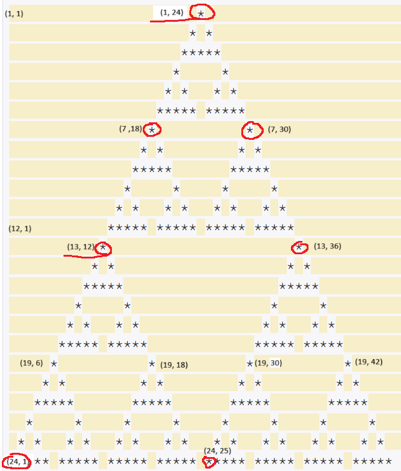

### 소스코드
```cpp
#include <iostream>
using namespace std;
int N;
bool star[6500][6500]; //len 최대 3*1024, 밑변 최대 3*1024*2,  1-based

void draw(int x, int y, int len) {
    if(len==3) { //basecase
        //(x, y)가 꼭짓점인 삼각형 그리기
        star[x][y]=true;
        star[x+1][y-1]=true;
        star[x+1][y+1]=true;
        star[x+2][y-2]=true;
        star[x+2][y-1]=true;
        star[x+2][y]=true;
        star[x+2][y+1]=true;
        star[x+2][y+2]=true;
        return;
    }
    draw(x, y, len/2); //up
    draw(x+len/2, y-len/2, len/2); //left
    draw(x+len/2, y+len/2, len/2); //right
}

void bt(int N) {
    draw(1, N, N);
}

void print() {
    for(int i=1; i<=N; i++) {
        for(int j=1; j<=N*2; j++) {
            if(star[i][j]) cout<<"*";
            else cout<<" ";
        }
        cout<<'\n';
    }
}

int main() {
    cin>>N;

    bt(N);

    print();

    return 0;
}

```

---
### 소요시간
10시간 이상 (집중력 부족 이슈..)

---
### 알고리즘
재귀

---
### 풀이


**[아이디어]**

좌상단이 (1, 1)이라고 하면, N = 24일 때 (1, 24)가 꼭짓점이고 양 변의 길이가 24인 삼각형을 그려야 한다.<br/>

이때, 크게 3개의 삼각형(위쪽 삼각형, 왼쪽 삼각형, 오른쪽 삼각형)으로 나눠서 생각해보자!<br/>

(1, 24), (13, 12), (13, 36)가 꼭짓점이고 양 변의 길이가 12인 삼각형 3개를 그려야 한다.<br/>

(1, 24)가 꼭짓점이고 양 변의 길이가 12인 삼각형은<br/>
(1, 24), (7, 18), (7, 30)이 꼭짓점이고 양 변의 길이가 6인 삼각형 3개를 그려야한다.<br/>

(13, 12)가 꼭짓점이고 양 변의 길이가 12인 삼각형은<br/>
(13, 12), (19, 6), (19, 18)이 꼭짓점이고 양 변의 길이가 6인 삼각형 3개를 그려야한다.<br/>

(13, 36)가 꼭짓점이고 양 변의 길이가 12인 삼각형은<br/>
(13, 36), (19, 30), (19, 42)이 꼭짓점이고 양 변의 길이가 6인 삼각형 3개를 그려야한다.<br/>

양 변의 길이가 6인 삼각형들은 또 양 변의 길이가 3인 삼각형 3개를 그리는 과정을 거치면 된다.<br/>

양 변의 길이가 3인 삼각형을 기저조건으로 두고 재귀함수를 호출하면 완성!!<br/><br/>


**[구현방법]**

bool형 2차원 배열을 넉넉히 선언해두고, 별을 찍어야하는 부분은 true를 저장한다. 2중 반복문을 돌면서 true이면 별을 출력하고 false이면 공백을 출력하면 된다.<br/>

배열의 크기는 어느정도로 설정해야할까?

`N은 항상 3×2^k 수이다. (3, 6, 12, 24, 48, ...) (0 ≤ k ≤ 10, k는 정수)`

N은 최대 3 x 1024 = 3072 이므로 삼각형의 양 변의 길이는 최대 3072이다. 밑변의 길이는 그것의 두배인 3 x 1024 x 2 이므로, 배열은 넉넉하게 6500 x 6500 의 크기로 선언해주었다. 


