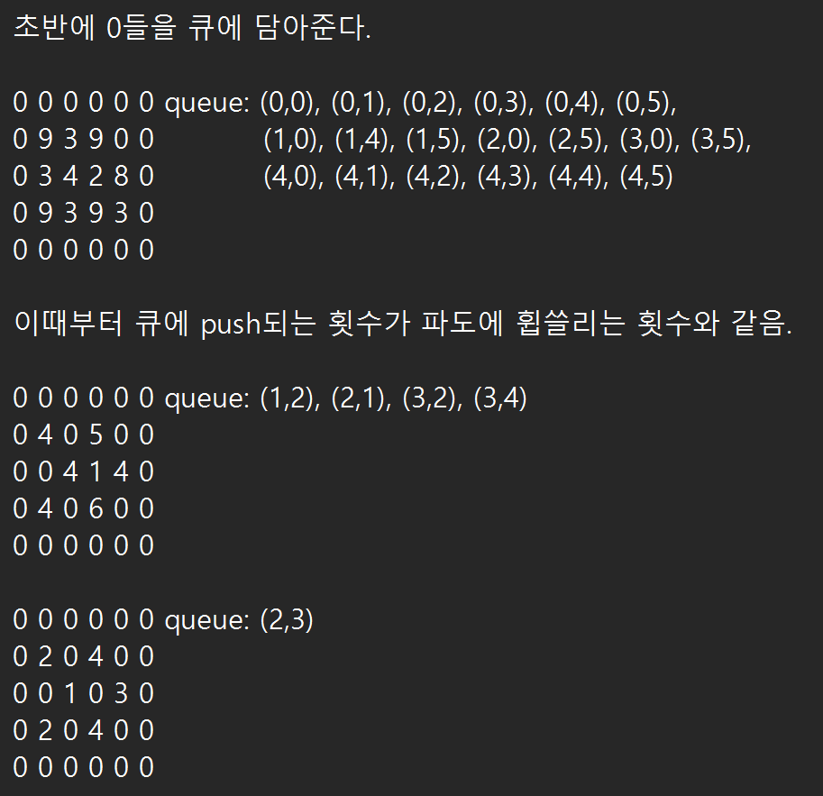
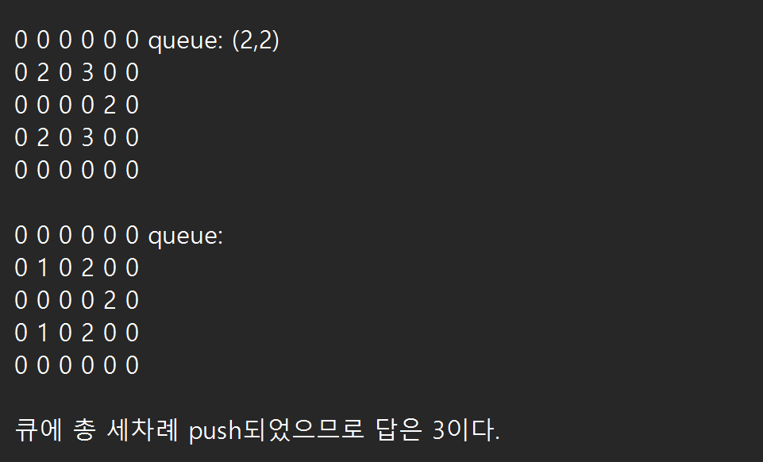

## 소스코드
```cpp
#include <algorithm>
#include <iostream>
#include <vector>
#include <queue>
using namespace std;

// 8방향을 봐서 모래성이 쌓여있지 않은 부분의 개수가 자기 모래성의 튼튼함보다
// 많거나 같은 경우 파도에 의해서 무너질 수 있음

int h,w;
int mat[1001][1001];
queue<pair<int,int>> q;
int dx[8] = {-1, -1, -1, 0, 0, 1, 1, 1};
int dy[8] = {-1, 0 ,1, -1, 1, -1, 0, 1};
int wave[1001][1001];
int ans;

void init() {
    cin>>h>>w;
    for(int i=0; i<h; i++) {
        string s; cin>>s;
        for(int j=0; j<w; j++) {
            if(s[j]=='.') {
                mat[i][j]=0;
                q.push({i,j});
            }
            else mat[i][j]=s[j]-'0';
        }
    }
}

void bfs() {
    while(!q.empty()) {
        pair<int,int> pii = q.front();
        q.pop();

        for(int d=0; d<8; d++) {
            int nx=pii.first+dx[d];
            int ny=pii.second+dy[d];
            if(nx<0||nx>=h||ny<0||ny>=w) continue;
            if(mat[nx][ny]) {
                mat[nx][ny]--;
                if(!mat[nx][ny]) {
                    q.push({nx,ny});
                    wave[nx][ny] = wave[pii.first][pii.second]+1;
                    ans=max(ans,wave[nx][ny]);
                }
            }
        }
    }
}

int main() {

    init();

    bfs();

    cout<<ans;
    return 0;
}


```


## 소요시간
1시간 30분 (정답 참고)


## 알고리즘
그래프탐색

## 풀이

알고리즘 분류와 정답을 참고하여 풀었음.(ㅠㅠ)

모래성이 아니라 평지를 기준으로 생각해주자. (<- 여기까진 혼자 떠올렸음. 근데 그 후에 감이 안잡혀서 정답 봤음)

1. 입력받기
    - .인 것들은 0으로 저장한다.
    - 0이 저장된 위치들은 큐에 pair로 담아준다.
2. 큐 pop 하기
    - 큐가 빌 때까지 pop을 해준다.
    - pop을 한 위치의 8방향에 있는 양수들을 1씩 차감해준다.
    - 1을 차감하여 0이된 위치는 큐에 담는다.
    - 큐에 몇 단계 push되었는지가 이 문제의 정답이다.

이런식으로 풀면 9가 계속 차감되어 사라지지않나 라는 의문이 든다. <br/>
하지만 직접 해보면 그렇지 않다는 것을 금방 깨달을 수 있다.<br/>
각 위치는 큐에 최대 한 번씩만 들어가기 때문이다.

---

예제1을 통해서 알아보자.


