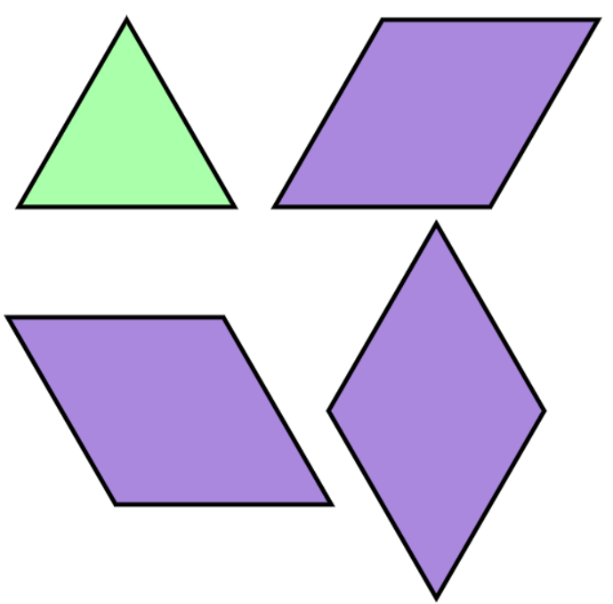

## 소스코드
```cpp
#include <stdio.h>
#include <stdbool.h>
#include <stdlib.h>

const int mod = 10007;

int dp[100001][2]; 
//dp[i][0]: i번째까지 정삼각or왼쪽사다리꼴or마름모로 채운 경우
//dp[i][1]: i번째까지 오른쪽사다리꼴로 채운 경우
int solution(int n, int tops[], size_t tops_len) {
    
    if(tops[0]){
        dp[0][0]=3;
        dp[0][1]=1;
    }
    else{
        dp[0][0]=2;
        dp[0][1]=1;
    }
    
    for(int i=1; i<n; i++){
        dp[i][1] = (dp[i-1][0] + dp[i-1][1])%mod;
        
        if(tops[i]){
            dp[i][0] = (dp[i-1][0]*3 + dp[i-1][1]*2)%mod;
        }
        else{
            dp[i][0] = (dp[i-1][0]*2 + dp[i-1][1])%mod;
        }
    }
    
    return (dp[n-1][0]+dp[n-1][1])%mod;
}


```


## 소요시간
4시간?


## 알고리즘
DP

## 풀이

못풀겠어서 진이 풀이를 슬 쩍 보고 풀었다..히히

타일을 채우는 방법은 4가지가 있다.

순서대로 1, 2, 3, 4 라고 하면 3만 오른쪽칸으로 삐져나왔다.

그래서 2차원 dp 배열을 다음과같이 만들어줬다.<br/>
`dp[i][0]`: i번째까지 정삼각(1) or 왼쪽사다리꼴(2) or 마름모(4)로 채운 경우의 수<br/>
`dp[i][1]`: i번째까지 오른쪽사다리꼴(3)로 채운 경우의 수

- dp[i][1] = (dp[i-1][0] + dp[i-1][1])%mod;<br/>
    현재 보고있는 칸을 3으로 채우려면 직전칸에 1, 2, 3, 4 전부 올 수 있다.

- tops[i]==1 인 경우,<br/>
    현재 칸을 1, 2, 4로 채울 수 있다.
    - dp[i][0] = (dp[i-1][0]*3 + dp[i-1][1]*2)%mod;<br/>
        직전칸이 1, 2, 4중 하나라면 현재 칸에 1, 2, 4중 하나로 채울 수 있으므로 dp[i-1][0] * 3을 더해준다.<br/>
        직전칸이 3이라면 현재칸에 1, 4중 하나로 채울 수 있으므로 dp[i-1][1] * 2을 더해준다.
        

- tops[i]==0 인 경우,<br/>
    현재 칸을 1, 2로 채울 수 있다.
    - dp[i][0] = (dp[i-1][0]*2 + dp[i-1][1])%mod;<br/>
        직전칸이 1, 2, 4중 하나라면 현재 칸에 1, 2중 하나로 채울 수 있으므로 dp[i-1][0] * 2를 더해준다.<br/>
        직전칸이 3이라면 현재칸을 1로만 채울 수 있으므로 dp[i-1][1]을 더해준다.