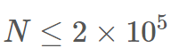

## 소스코드
```cpp
#include <iostream>
#include <vector>
#include <climits>
#include <algorithm>
#include <queue>
using namespace std;
typedef pair<int,int> pii;
typedef long long ll;

int n;
string A; //1이면 실내(검정)
vector<int> adj[200001];
int vis[200001];
ll ans = 0;

ll dfs(int i) { //실내 나올때까지 탐색

    ll inside = 0;
    vis[i] = 1;

    for(auto k : adj[i]) {
        if(A[k-1]=='1') inside++; //실내이면 갯수 증가
        else if(A[k-1]=='0' && !vis[k]) inside+=dfs(k); //실외이면 탐색

    }

    return inside;
}

int main() {

    cin >> n >> A;
    for(int i=0; i<n-1; i++) {
        int a,b; cin>>a>>b;
        adj[a].push_back(b);
        adj[b].push_back(a);
        if(A[a-1]=='1' && A[b-1]=='1') ans+=2;
    }

    for(int i=1; i<=n; i++) {
        if(A[i-1]=='0' && !vis[i]) { //방문하지 않은 실외일때만 탐색
            ll cnt = dfs(i); //실내 노드 개수 반환
            ans += cnt*(cnt-1);
        }
    }
    cout<<ans;
    return 0;
}


```


## 소요시간
5시간


## 알고리즘
그래프탐색

## 풀이

시작점과 끝점만 실내일 떄 서로 다른 산책 경로가 몇가지인지 구해야한다.
도중에 실내를 만나면 안되므로 실외를 기준으로 그래프 탐색을 해준다.


- 시작이 실외인 경우만 dfs탐색을 한다.
- 실내를 만나면 실내 개수를 증가하고, 실외를 만나면 탐색을 계속한다.
- (실내 개수) * (실내 개수 -1) 을 정답에 누적으로 더한다.

이렇게 했을 때, 실내끼리 인접해있는 케이스를 구하지 못하는데 이는 입력받을때 실내끼리 연결된 간선이 들어오면 정답에 2를 더해줌으로써 처리한다.


여기서 2를 못보고 배열크기를 10만으로 잡아서 맞왜틀로 몇시간을 날렸다.ㅠ