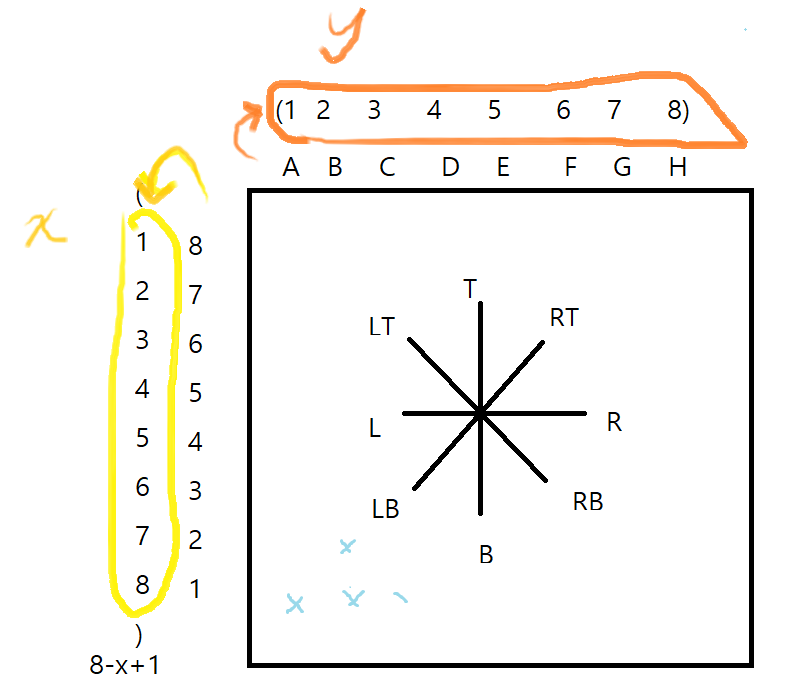

## 소스코드

```cpp
#include <iostream>
#include <deque>
#include <map>
#include <vector>
using namespace std;

struct pos {
    int x, y;
};

int main(){
    ios_base::sync_with_stdio(0);
    cin.tie(0);

    string a,b; cin>>a>>b;

    pos king, stone;
    king.x = 8-(a[1]-'0')+1;
    king.y = a[0]-'A'+1;
    stone.x = 8-(b[1]-'0')+1;
    stone.y = b[0]-'A'+1;

    int n; cin>>n;
    while(n--) {
        string s; cin>>s;
        if(s=="R") {
            if(king.y+1<=8) { //킹 이동 가능하면
                king.y++; //옮겨줌
                if(king.x==stone.x && king.y==stone.y) { //이동한곳에 돌이있으면
                    if(stone.y+1<=8) stone.y++; //돌도 옮겨줌
                    else king.y--; //돌 이동 불가능하면 킹 옮긴 것도 원위치
                }
            }
        }
        else if(s=="L") {
            if(king.y-1>=1) {
                king.y--;
                if(king.x==stone.x && king.y==stone.y) {
                    if(stone.y-1>=1) stone.y--;
                    else king.y++;
                }
            }
        }
        else if(s=="B") {
            if(king.x+1<=8) {
                king.x++;
                if(king.x==stone.x && king.y==stone.y) {
                    if(stone.x+1<=8) stone.x++;
                    else king.x--;
                }
            }
        }
        else if(s=="T") {
            if(king.x-1>=1) {
                king.x--;
                if(king.x==stone.x && king.y==stone.y) {
                    if(stone.x-1>=1) stone.x--;
                    else king.x++;
                }
            }
        }
        else if(s=="RT") {
            if(king.x-1>=1 && king.y+1<=8) {
                king.x--, king.y++;
                if(king.x==stone.x && king.y==stone.y) {
                    if(stone.x-1>=1 && stone.y+1<=8) stone.x--, stone.y++;
                    else king.x++, king.y--;
                }
            }
        }
        else if(s=="LT") {
            if(king.x-1>=1 && king.y-1>=1) {
                king.x--, king.y--;
                if(king.x==stone.x && king.y==stone.y) {
                    if(stone.x-1>=1 && stone.y-1>=1) stone.x--, stone.y--;
                    else king.x++, king.y++;
                }
            }
        }
        else if(s=="RB") {
            if(king.x+1<=8 && king.y+1<=8) {
                king.x++, king.y++;
                if(king.x==stone.x && king.y==stone.y) {
                    if(stone.x+1<=8 && stone.y+1<=8) stone.x++, stone.y++;
                    else king.x--, king.y--;
                }
            }
        }
        else if(s=="LB") {
            if(king.x+1<=8 && king.y-1>=1) {
                king.x++, king.y--;
                if(king.x==stone.x && king.y==stone.y) {
                    if(stone.x+1<=8 && stone.y-1>=1) stone.x++, stone.y--;
                    else king.x--, king.y++;
                }
            }
        }
    }

    cout<<(char)(king.y-1+'A');
    cout<<9-king.x;
    cout<<'\n';
    cout<<(char)(stone.y-1+'A');
    cout<<9-stone.x;
    return 0;
}


```

## 소요시간

45분

## 알고리즘

구현

## 풀이

문제에서 하라는대로 구현해주면 된다.


좌표는 내가 보기 편한대로 바꿔서 풀었다.

문제 지문이 맘에 안든다.

`체스판에는 돌이 하나 있는데, 돌과 같은 곳으로 이동할 때는, 돌을 킹이 움직인 방향과 같은 방향으로 한 칸 이동시킨다. 아래 그림을 참고하자.`
: 킹을 움직였는데 그 자리에 돌이 있으면 돌도 움직이라는 뜻

`입력으로 킹이 어떻게 움직여야 하는지 주어진다. 입력으로 주어진 대로 움직여서 킹이나 돌이 체스판 밖으로 나갈 경우에는 그 이동은 건너 뛰고 다음 이동을 한다.`
: 킹 움직 -> 돌 움직 했는데 돌이 체스판 밖으로 나간다면, 돌 움직 취소 뿐만아니라 킹 움직도 취소해야함
