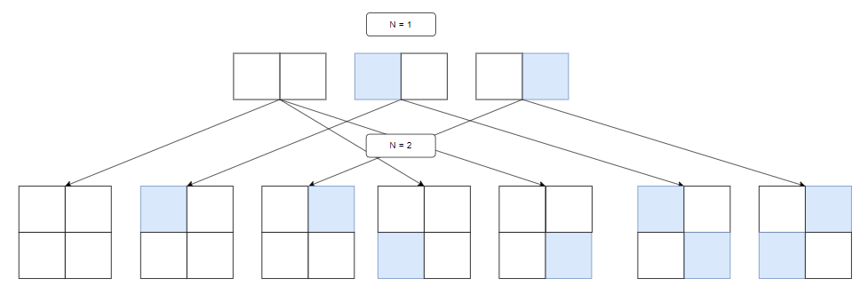

-------------
# 기본 로직
1. n-1칸이 비어있는 경우 n번째 칸에 호랑이가 없는 경우, 왼쪽, 오른쪽에 있는 경우 가능
2. n-1칸이 비어있지 않은 경우 n번째 칸을 비우는 경우 + n-1번째 칸의 반대에 놓는 경우
3. n-1칸이 비어 있는 경우 dp[n][0] = dp[n-1][0] + dp[n-1][1] + dp[n-1][2]
4. n-1칸이 비어있지 않은 경우 
5. (왼쪽) dp[n][1] = dp[n-1][0] + dp[n-1][2]; n-1칸이 비어있거나 오른쪽에 있는 경우
6. (오른쪽) dp[n][2] = dp[n-1][0] + dp[n-1][1]; n-1칸이 비어있거나 왼쪽에 있는 경우 
-------------
