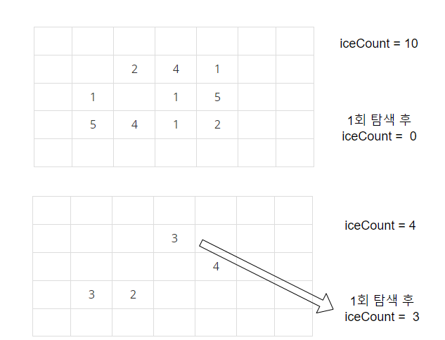

-------------
# 기본 로직
1. 반복 수행할 때 마다 4방 탐색하여 0인 부분만큼 얼음의 크기를 줄인다.
2. 녹은 상태에서 얼음의 개수 (iceCount)를 구한다.
3. bfs, dfs 탐색시 얼음을 만날 때 마다 얼음의 개수를 하나씩 뺀다.
4. 1회 탐색 후 얼음의 개수가 0이 아니라면 더 탐색할 군집이 남아있다. (2개 이상으로 분리되었다.)
5. 탐색 종료 후, 현재 년도 출력 
-------------

# 주의사항
1. 맵 정보를 배열 하나만 사용할 경우, map[1][1]이 2 -> 0이 되었을 때,   
   map[1][2]가 map[1][1]의 영향을 받아 1만큼 더 녹을 수 있다.
2. 따라서, meltMap 배열을 하나 더 선언하여 이를 녹이도록 한다.
3. 모두 녹은 경우를 생각해야 하기 때문에, 탐색 전 iceCount가 0이면 0을 출력한다.
4. -------------