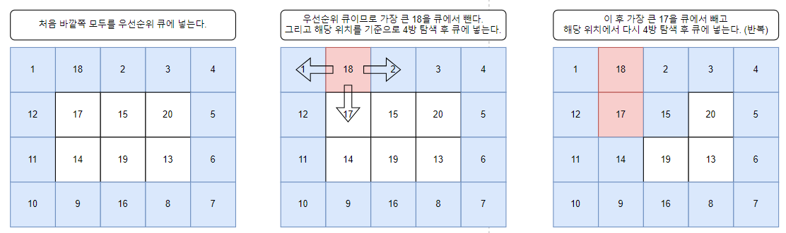
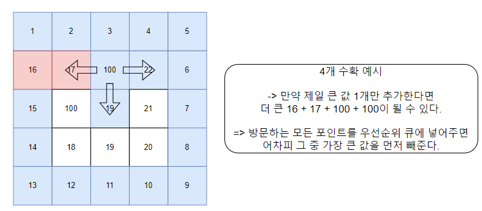

# BOJ 30024 옥수수밭 - 2024-01-31

-------------
# 기본 로직
1. row, col, cost 정보를 가지고 있어야 하기 때문에 Field클래스 선언
2. 우선 순위 큐를 통해 가장 큰 값을 이용하기 위해 cost를 비교하여 더 큰 값이 우선순위가 높도록 Comparable을 구현
3. 처음 가장 외곽을 모두 큐에 넣는다. (가능한 모든 경우를 넣는다.)
4. 우선 순위 큐에서 가장 큰 값을 빼낼 수 있기 때문에 빼낸 객체에 저장된 정보를 통해 4방 탐색을 수행한 후 큐에 넣는다.
5. 4번 과정을 반복하며 cnt--를 통해 설정 횟수가 되면 종료한다.
-------------

# 주의사항
1. 처음에는 아무 생각없이 4방 탐색 시 가장 큰 값만 넣어줘야겠다고 생각했다.
2. 하지만, 그림 2번의 문제를 만나게 되어 어차피 방문하는 모든 지점을 큐에 넣어도 가장 비용이 큰 값을 가장 먼저 빼주기 때문에 
    방문하는 모든 지점의 정보를 넣어줘야 한다!.
-------------