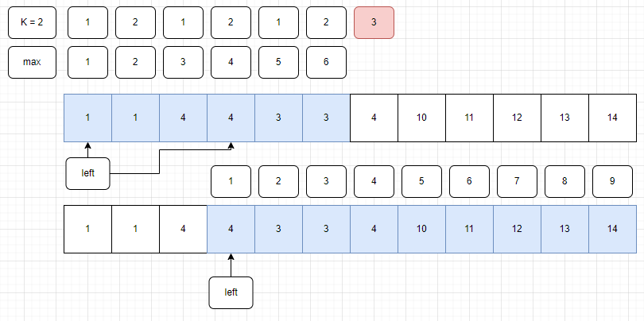

-------------
# 소요 시간 : 50분
# 기본 로직
1. 처음에 수의 범위만큼 배열을 생성해둔다.    
    해당 배열은 현재 수가 몇개 나왔는지 카운팅할 때 사용
2. 부분 수열을 확인할 때, 현재까지의 부분 수열에 현재 추가하려는 수가 K개보다 작게 있다면     
   현재 수를 카운팅해주고, 부분 수열의 길이를 최대값에 업데이트한다.
3. 만약, 현재 추가하려는 수가 K개 만큼 부분수열에 들어있다면,    
   왼쪽에서 가장 가까운 해당 수 다음부터 현재 추가하려는 수까지 부분 수열을 만들면    
   현재 수를 추가하며 만들 수 있는 최대 길이의 부분 수열이다.
4. 따라서, 새롭게 만들어진 부분수열부터 다시 부분수열의 개수를 센다. 
-------------