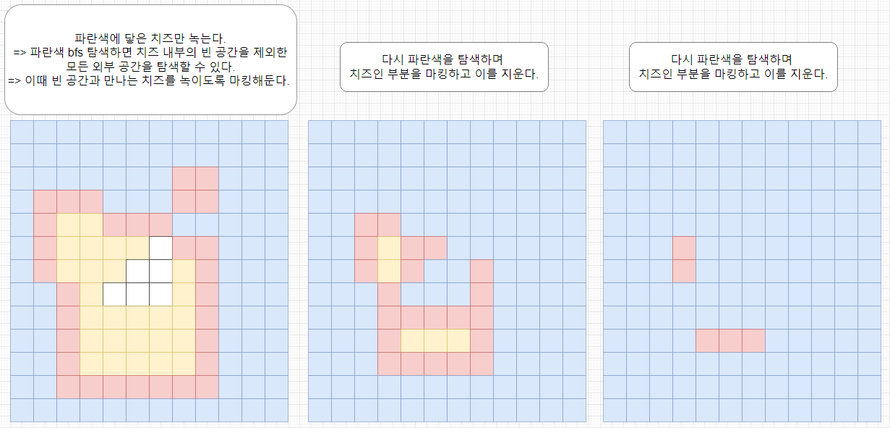

-------------
# 소요 시간 : 45분
# 기본 로직
1. 맵을 초기화하며 치즈의 총 개수를 구해둔다.
2. 맵에서 가장자리는 0이므로, (0,0)부터 0인 부분을 모두 탐색한다.
3. 해당 과정을 통해서 치즈 내부의 0은 탐색하지 않을 수 있으며,  
    가장자리를 탐색하는 것이기 때문에 가장자리와 닿은 치즈를 마킹해둘 수 있다.
4. 전체 탐색 후 가장자리의 모든 치즈를 녹인다.
5. 방문 확인 배열 (isVisted), 녹여야 하는 가장자리 치즈 배열 (isBorder)를 초기화하고 2~4과정을 반복한다.
6. 이때, 각 반복마다 치즈의 개수가 0이 아닌 경우 preCheese에 현재 치즈 개수를 저장해둔다.   
   (이후 마지막 출력을 위해)
7. 탐색 종료 후, 지난 년도 + 마지막 녹기 전 치즈 개수 출력
-------------

# 생각해보아야 할 점
1. 치즈 외부의 0과 내부의 0을 어떻게 따로 처리해야할지 고민해 보는 것이 중요하다.
2. 이를 외부의 0을 탐색하면, 1로 둘러쌓인 내부의 0은 탐색하지 못한다는 생각하고 풀이를 시작했다.