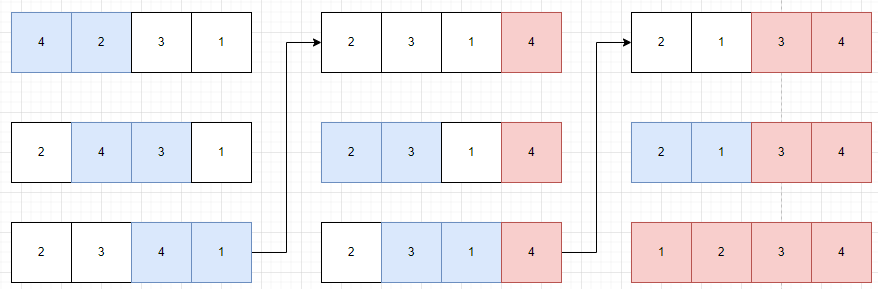
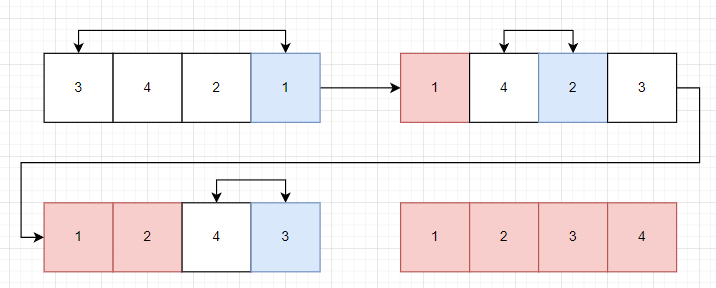
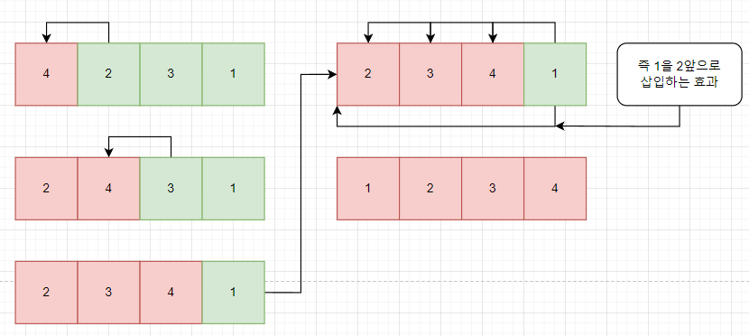

# 버블 정렬

1. 현재 인덱스와 이전 인덱스의 값을 비교한다.
2. 현재 인덱스가 이전 인덱스보다 작다면 스왑 (오름차순 이므로)
3. 이를 배열의 끝까지 수행하면 마지막 인덱스가 가장 큰 값이므로    
다음 반복부터 정렬된 인덱스를 제외한 부분까지만 정렬 수행 
-------------
# 선택 정렬

1. 반복문을 돌며 가장 작은 값의 인덱스를 찾는다.
2. 가장 작은 값을 가장 앞에 배치한다.
3. 다음 반복부터 그 다음 작은 값을 찾아 가장 작은 값 뒤로 배치한다.
-------------
# 삽입 정렬

1. 현재 인덱스와 이전 인덱스의 값을 비교한다.
2. 현재 인덱스가 이전 인덱스보다 작다면 스왑 (오름차순 이므로)
3. 이를 배열의 끝까지 수행하면 마지막 인덱스가 가장 큰 값이므로    
다음 반복부터 정렬된 인덱스를 제외한 부분까지만 정렬 수행 
-------------
