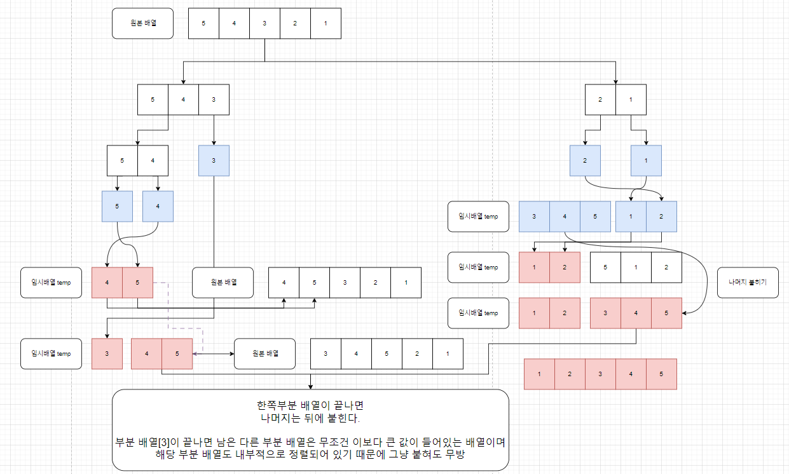

# 병합 정렬

1. 배열을 더 이상 쪼개지지 않을 때까지 쪼갠다    
   (배열의 원소가 1개일 때 1개는 이미 정렬된 상태로 간주)
2. 쪼개진 배열 2개의 첫번째 원소부터 비교하여 더 작은 값을 임시 배열에 먼저 채운다.
3. 이때, 하나의 부분 배열의 모든 원소를 채웠지만, 나머지 부분 배열의 원소가 남아있는 경우    
   해당 부분 배열은 모두 정렬되어 채워진 배열의 원소들보다 큰 값이므로 그대로 배열의 뒤에 붙힌다.
-------------
