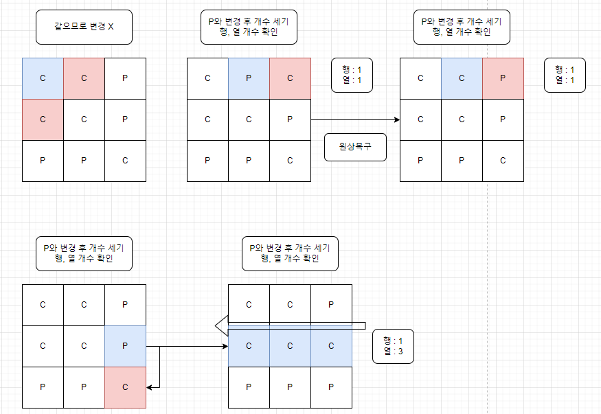

-------------
# 소요 시간 : 30분
# 기본 로직
1. 현재 위치 (i, j)에서 4방 탐색 (인덱스를 넘어가는 경우 제외) + 다른 색인 경우에 swap
2. 열 개수 카운팅 :    
   현재 위치 (i, j)에서 열 [i][j ~ 0] + [i][j + 1 ~ N]으로 개수 카운팅 (도중에 다른 색이 나오면 break)
3. 행 개수 카운팅 :    
   현재 위치 (i, j)에서 행 [i ~ 0][j] + [i + 1 ~ N][j]으로 개수 
   카운팅 (도중에 다른 색이 나오면 break)
4. 개수 카운팅이 끝나면 max 값을 업데이트
5. 카운팅 과정에서 현재 값을 추가하지 않았기 때문에 + 1로 출력
-------------
# 주의사항
1. 한번 변경한 후 다음 탐색에 영향을 주지 않기 위해 원상복구 해야한다.