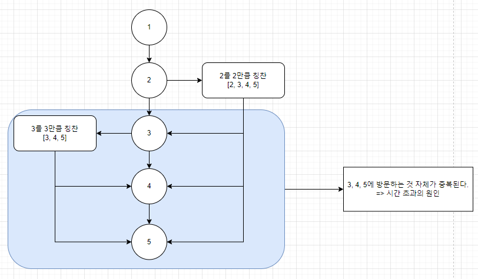

# BOJ 14267 회사문화 1
# 소요 시간 : 60분
# 기본 로직
1. 현재 자식의 부모를 입력으로 받으므로, 입력으로 들어온 부모의 인접리스트를 관리한다.
2. 이때, 자식이 있는 경우에만 인접리스트를 생성하고 나중에 인접리스트가 null이면 자식이 없는 경우로 사용한다 (-> dfs 기저조건)
3. 입력받은 칭찬받은 인원과 칭찬의 값을 배열에 모두 저장한다.    
   ex) 2번 칭찬 -> ans[2]에 저장
4. 칭찬이 모두 끝나면 부모 노드부터 dfs탐색을 하며 자식들의 칭찬 값에 더해준다.
-------------
# 주의사항

-------------
1. 그림에서 3, 4, 5가 중복으로 방문된다.
2. 만약 M개의 칭찬 입력마다 dfs를 돌리면 중복되는 부분이 생겨 시간초과 발생
3. 따라서 기본 로직의 3번 ans[2]에 저장하는 로직을 통해 해당 인원이 받은 칭찬만 일단 저장해둔다.
4. 이후, 루트 노드 (1)에서부터 dfs를 통해 모든 자식에 부모의 칭찬을 더해서 업데이트 해준다.
-------------