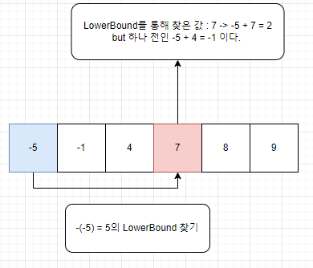

# BOJ 2467 용액
# 소요 시간 : 40분
# 기본 로직

---
1. 주어진 내에서 두 수의 합이 0에 가까운 값을 구해야 하므로, 하나의 수를 정한다.
2. 선택한 수와 가장 0에 가까운 다른 수를 찾아서 차이가 적은 것을 갱신해야 한다고 생각했다.
3. 이를 쉽게 2중포문으로 생각해서 해결하려면 O(1,000,000 * 1,000,000)의 시간이 걸릴 것이다.
4. 따라서, 정렬이 되어 있기 때문에 이분탐색을 해야 한다고 생각했다.
5. 여기서 LowerBound를 통해 해당 수와 가장 0이 될 수 있는 가능성이 있는 수를 찾는다.
6. 이때, LowerBound 특성 상 원하는 수와 같더나 큰 가장 처음 수의 인덱스를 받으므로,     
   찾은 인덱스의 1, -1의 인덱스도 함께 찾아보고 갱신해준다.
-------------
# 주의사항
1. 그냥 LowerBound를 사용해서 해당 인덱스를 사용하게 되면, 본인을 두번 출력할 수 있으므로    
    LowerBound를 사용하여 얻은 인덱스와 다를 때만 갱신하도록 한다.