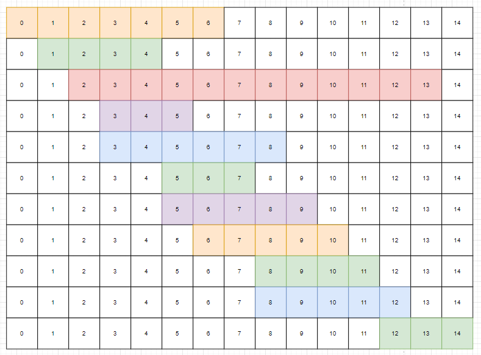

# BOJ 1931 회의실 배정
# 소요 시간 : 20분
# 기본 로직

1. 시작시간을 기준으로 정렬하되, 같으면 종료시간이 더 빠른 것을 기준으로 정렬
2. 기본적으로 시간이 빠른 회의를 먼저 선택 -> 이후에 선택한 회의보다 일찍 끝나는 회의가 있다면? => 교체
3. 예를들어 0~6을 선택, 다음 회의가 1~4라면 0~6대신 1~4를 선택
4. 만약 먼저 끝나지 않지만, 현재 회의 이후에 해당 회의가 가능하다면? 회의 개수 1개 추가 및 다음 회의와 비교 대상으로 선정 후 2번 과정 반복
-------------