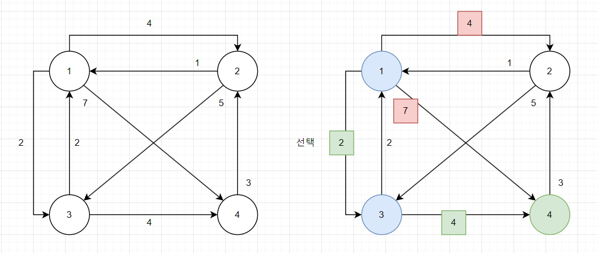
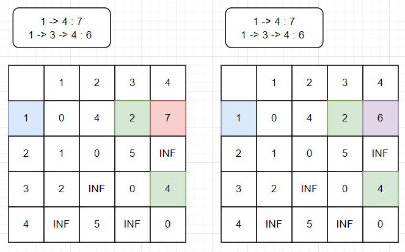

# 소스코드

```Java
import java.io.*;
import java.util.Arrays;
import java.util.StringTokenizer;

public class Main {
    static final int INF = Integer.MAX_VALUE;
    static int[][] minDist;
    static Node[] adjList;
    static int N, M, X;
    public static void main(String[] args) throws IOException {
        BufferedReader br = new BufferedReader(new InputStreamReader(System.in));
        BufferedWriter bw = new BufferedWriter(new OutputStreamWriter(System.out));
        StringBuilder sb = new StringBuilder();

        StringTokenizer st = new StringTokenizer(br.readLine());
        N = Integer.parseInt(st.nextToken());
        M = Integer.parseInt(st.nextToken());
        X = Integer.parseInt(st.nextToken());

        adjList = new Node[N+1];
        for (int i = 0; i < M; i++) {
            st = new StringTokenizer(br.readLine());
            int from = Integer.parseInt(st.nextToken());
            int to = Integer.parseInt(st.nextToken());
            int weight = Integer.parseInt(st.nextToken());

            adjList[from] = new Node(to, weight, adjList[from]);
        }

        minDist = new int[N+1][N+1];
        for (int i = 1; i <= N; i++) {
            Arrays.fill(minDist[i], INF);
        }
        for (int i = 1; i <= N; i++) {
            minDist[i][i] = 0;
            dijkstra(i);
        }
        int max = 0;
        for (int i = 1; i <= N; i++) {
            max = Math.max(max, minDist[i][X] + minDist[X][i]);
        }
        sb.append(max);
        bw.write(sb.toString());
        bw.flush();
        br.close();
    }

    public static void dijkstra(int vertex) {
        int min = 0, stopOver = 0;
        boolean[] isv = new boolean[N + 1];
        for (int i = 1; i <= N; i++) {
            min = INF;
            stopOver = -1;
            for (int j = 1; j <= N; j++) {
                if(!isv[j] && min > minDist[vertex][j]){
                    min = minDist[vertex][j];
                    stopOver = j;
                }
            }
            if(stopOver == -1) break;
            isv[stopOver] = true;

            for (Node temp = adjList[stopOver]; temp != null; temp = temp.next) {
                if (minDist[vertex][temp.vertex] > min + temp.weight) {
                    minDist[vertex][temp.vertex] = min + temp.weight;
                }
            }
        }
    }
}

class Node{
    int vertex, weight;
    Node next;

    public Node(int vertex, int weight, Node next) {
        this.vertex = vertex;
        this.weight = weight;
        this.next = next;
    }
}
```

# 소요시간

40분

# 알고리즘

다익스트라

# 풀이

# BOJ 1238 파티




# 기본 로직

1. `이 학생들은 워낙 게을러서 최단 시간에 오고 가기를 원한다.`라는 조건이 있으므로 최단 경로를 찾아야 한다.
2. 최단 경로를 구하기 위해서 다익스트라 알고리즘을 이용했다.
3. 출발지 (이 문제에서는 모든 정점을 기준으로 수행) 로부터 갈 수 있는 경로 중  
   가장 가까운 거리부터 경유지로 사용해서 다른 정점까지의 거리를 단축시킬 수 있다면 minDist배열에서 업데이트 해준다.
4. 출력할 값은 주어진 예시로 본다면 2로 갔다가 다시 돌아오는 거리가 가장 긴 것을 출력하는 것으로  
   2차원 배열에 다익스트라 알고리즘으로 최단 경로를 구해둔다.
5. 최종적으로 구해둔 최단 경로 행렬에서 minDist[A][X] + minDist[X][A]를 하면 주어진 정점에서  
   파티가 열리는 곳으로 이동했다가, 다시 집으로 돌아오는 최단 경로를 알 수 있고 이 중 최대를 출력한다.
