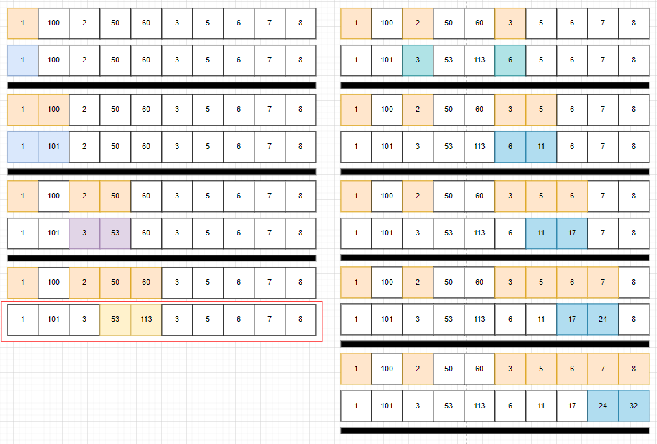

# 소스코드

```Java
import java.io.BufferedReader;
import java.io.IOException;
import java.io.InputStreamReader;
import java.util.StringTokenizer;

public class Main {
    public static void main(String[] args) throws IOException {
        BufferedReader br = new BufferedReader(new InputStreamReader(System.in));
        int N = Integer.parseInt(br.readLine());

        int[] arr = new int[N];
        int[] dp = new int[N + 1];
        StringTokenizer st = new StringTokenizer(br.readLine());
        int res = 0;
        for (int i = 0; i < N; i++) {
            arr[i] = Integer.parseInt(st.nextToken());
            dp[i] = arr[i];
            for (int j = i - 1; j >= 0; j--) {
                if (arr[i] > arr[j]) {
                    dp[i] = Math.max(dp[i], dp[j] + arr[i]);
                }
            }
            res = Math.max(res, dp[i]);
        }

        System.out.println(res);
    }
}
```

# 소요시간

30분

# 알고리즘

DP

# 풀이

# BOJ 11055 가장 큰 증가하는 부분 수열

# 기본 로직



1. 현재를 기준으로 왼쪽의 값을 확인해서 나보다 작은지 확인한다.
2. 나보다 작다면 해당 값까지의 누적합 값과 내 값을 더한 값  
   vs 같은 방법으로 구해진 이전 값과 비교해서 더 큰 값을 dp에 저장한다.
3. 구해진 값 중 가장 큰 값을 출력한다.

---
