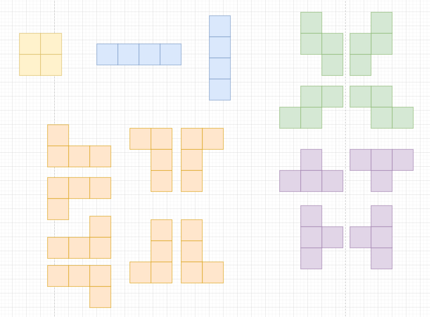

# 소스코드

```Java
import java.io.*;
import java.util.StringTokenizer;


public class Main {
    static int[][][][] dir = {{
                    {{0, 1}, {1, 0}, {1, 1}}}, //ㅁ
                    {{{1, 0}, {2, 0}, {3, 0}}, //-
                    {{0, 1}, {0, 2}, {0, 3}}},
                    {{{0, 1}, {0, 2}, {1, 2}}, //ㄱ
                    {{0, 1}, {0, 2}, {-1, 2}},
                    {{1, 0}, {1, 1}, {1, 2}},
                    {{1, 0}, {0, 1}, {0, 2}},
                    {{0, 1}, {1, 1}, {2, 1}},
                    {{1, 0}, {2, 0}, {0, 1}},
                    {{1, 0}, {2, 0}, {2, -1}},
                    {{1, 0}, {2, 0}, {2, 1}}},
                    {{{0, 1}, {-1, 1}, {-1, 2}},//ㄱㄴ
                    {{0, 1}, {1, 1}, {1, 2}},
                    {{1, 0}, {1, 1}, {2, 1}},
                    {{1, 0}, {1, -1}, {2, -1}}},
                    {{{1, 0}, {2, 0}, {1, 1}},//ㅗ
                    {{1, 0}, {2, 0}, {1, -1}},
                    {{0, 1}, {0, 2}, {1, 1}},
                    {{0, 1}, {0, 2}, {-1, 1}}}};
    static int max = 0, N, M;
    static int[][] map;
    public static void main(String[] args) throws IOException {
        BufferedReader br = new BufferedReader(new InputStreamReader(System.in));
        BufferedWriter bw = new BufferedWriter(new OutputStreamWriter(System.out));

        StringTokenizer st = new StringTokenizer(br.readLine());
        N = Integer.parseInt(st.nextToken());
        M = Integer.parseInt(st.nextToken());
        map = new int[N][M];
        for (int i = 0; i < N; i++) {
            st = new StringTokenizer(br.readLine());
            for (int j = 0; j < M; j++) {
                map[i][j] = Integer.parseInt(st.nextToken());
            }
        }
        for (int i = 0; i < N; i++) {
            for (int j = 0; j < M; j++) {
                calcSum(i, j);
            }
        }
        bw.write(String.valueOf(max));
        bw.flush();
        bw.close();
    }

    private static void calcSum(int row, int col) {
        for (int k = 0; k < dir.length; k++) {
            for (int l = 0; l < dir[k].length; l++) {
                int sum = map[row][col];
                for (int m = 0; m < dir[k][l].length; m++) {
                    int x = row + dir[k][l][m][0];
                    int y = col + dir[k][l][m][1];
                    if(x < 0 || x >= N || y < 0 || y >= M) {
                        sum = -1;
                        break;
                    }
                    sum += map[x][y];
                }
                max = Math.max(max, sum);
            }
        }
    }
}
```

# 소요시간

40분

# 알고리즘

구현

# 풀이

# BOJ 14500 테트로미노

# 기본 로직



1. 5개의 폴리오미노를 대칭, 회전시켜서 나올 수 있는 경우의 수를 모두 구한다.
2. 이때, 폴리오미노 각각의 모양에서 위쪽을 기준으로 dx, dy를 설정한다.
3. 이를 map상의 한 포인트마다 테트로미노를 넣어보고 max값을 업데이트 한다.

---
