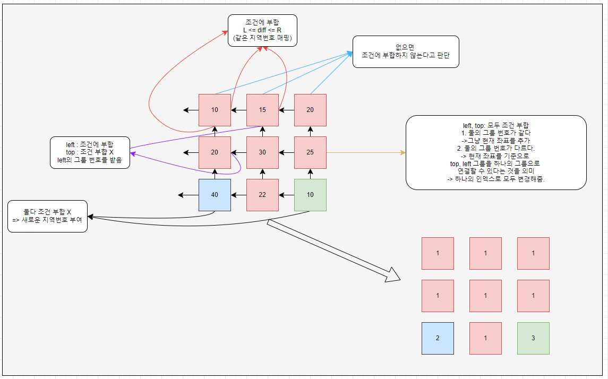

# 소스코드

```Java
import java.io.*;
import java.util.*;

public class Main {
    static int[][] map;
    static int N, L, R;
    static int count = 0;
    public static void main(String[] args) throws IOException {
        BufferedReader br = new BufferedReader(new InputStreamReader(System.in));
        BufferedWriter bw = new BufferedWriter(new OutputStreamWriter(System.out));
        StringTokenizer st = new StringTokenizer(br.readLine());

        N = Integer.parseInt(st.nextToken());
        L = Integer.parseInt(st.nextToken());
        R = Integer.parseInt(st.nextToken());
        map = new int[N][N];
        for (int i = 0; i < N; i++) {
            st = new StringTokenizer(br.readLine());
            for (int j = 0; j < N; j++) {
                map[i][j] = Integer.parseInt(st.nextToken());
            }
        }
        int day = 0;
        while (true){
            if(checkMove()) break;
            day++;
        }
        bw.write(String.valueOf(day));
        bw.flush();
        bw.close();
    }
    //4-connectivity
    private static boolean checkMove() {
        int idx = 1;
        int[][] mark = new int[N][N];
        Map<Integer, ArrayList<int[]>> markMap = new TreeMap<>();
        for (int i = 0, top = -1; i < N; i++, top++) {
            for (int j = 0, left = -1; j < N; j++, left++) {
                //현재 위치 기준 top의 mark를 확인
                int topMark = -1;
                if (top >= 0) {
                    int diff = Math.abs(map[top][j] - map[i][j]);
                    if(diff >= L && diff <= R) {
                        topMark = mark[top][j];
                    }
                }
                int leftMark = -1;
                if (left >= 0) {
                    int diff = Math.abs(map[i][left] - map[i][j]);
                    if(diff >= L && diff <= R) {
                        leftMark = mark[i][left];
                    }
                }
                //위 왼쪽 모두 없거나 둘 다 조건 만족 X
                if (leftMark == -1 && topMark == -1) {
                    //새롭게 인덱싱
                    mark[i][j] = idx++;
                    markMap.put(mark[i][j], new ArrayList<>());
                    markMap.get(mark[i][j]).add(new int[]{i, j});
                } else if (leftMark != -1 && topMark != -1) {
                    //둘다 있을 때 (둘다 가능 -> 하나의 지역이 된다.)
                    //왼쪽 인덱싱으로 추가하고
                    //위쪽 인덱싱의 List를 추가하고
                    //맵에서 키 삭제
                    mark[i][j] = leftMark;
                    if(leftMark == topMark){
                        markMap.get(mark[i][j]).add(new int[]{i, j});
                        continue;
                    }
                    for (int k = 0; k < markMap.get(topMark).size(); k++) {
                        int[] point = markMap.get(topMark).get(k);
                        markMap.get(mark[i][j]).add(point);
                        mark[point[0]][point[1]] = mark[i][j];
                    }
                    markMap.get(mark[i][j]).add(new int[]{i, j});
                    markMap.remove(topMark);
                } else {
                    //둘 중 하나만 연결되는 경우
                    mark[i][j] = leftMark != -1 ? leftMark : topMark;
                    markMap.get(mark[i][j]).add(new int[]{i, j});
                }
            }
        }
        //각각 원소가 하나의 집합을 이루면 더 이상 합쳐지지 않는 것을 의미함.
        if (mark[N-1][N-1] == N * N) return true;
        for (Integer key : markMap.keySet()) {
            List<int[]> list = markMap.get(key);
            int sum = 0;
            for (int i = 0; i < list.size(); i++) {
                int[] point = list.get(i);
                sum += map[point[0]][point[1]];
            }
            int res = sum / list.size();
            for (int i = 0; i < list.size(); i++) {
                int[] point = list.get(i);
                map[point[0]][point[1]] = res;
            }
        }
        return false;
    }
}
```

# 소요시간

50분

# 알고리즘

# 풀이

구현

# BOJ 16234 인구이동

# 기본 로직



1.  오른쪽, 아래 방향으로 이동하며 그룹을 만든다.
2.  현재 좌표기준으로 왼쪽, 위쪽이 그루핑된 것이므로 왼쪽의 그룹번호, 위쪽의 그룹번호를 확인한다.  
    (아래, 오른쪽은 아직 탐색이 안된 상태)
    1. 왼쪽, 위쪽 모두 연결이 불가능한 경우
       > 이 경우에는 현재 좌표와 연결될 수 있는 것이 없으므로, 새로운 지역 번호를 준다.
    2. 둘 중 하나와만 연결되는 경우
       > 이 경우에는 top, left중 연결될 수 있는 지역번호를 그대로 받는다.
    3. 둘 다 연결 가능한 경우
       > 이 경우에는 현재 좌표를 기준으로 top, left가 다르지만
       > 현재 죄표를 통해 top-현재-left가 이어지므로 이 3개를 하나의 지역으로 묶어준다.
3.  종료조건 : 지역번호 인덱싱 방법을 1부터 생성해나가는 방식을 이용
    > 위의 과정을 진행하다보면, 지역이 연결되지 않을 때 인덱스가 증가하게 된다.  
    > 이를 이용하면 모든 지역이 더 이상 연결되지 못한다 -> 이동이 끝났다. 로 해석할 수 있으므로,
         mark의 마지막 요소의 지역번호가 N * N이면 모든 지역이 각각 자신 하나만을 가지는 그룹으로 연결된 것이므로 종료한다.

---
