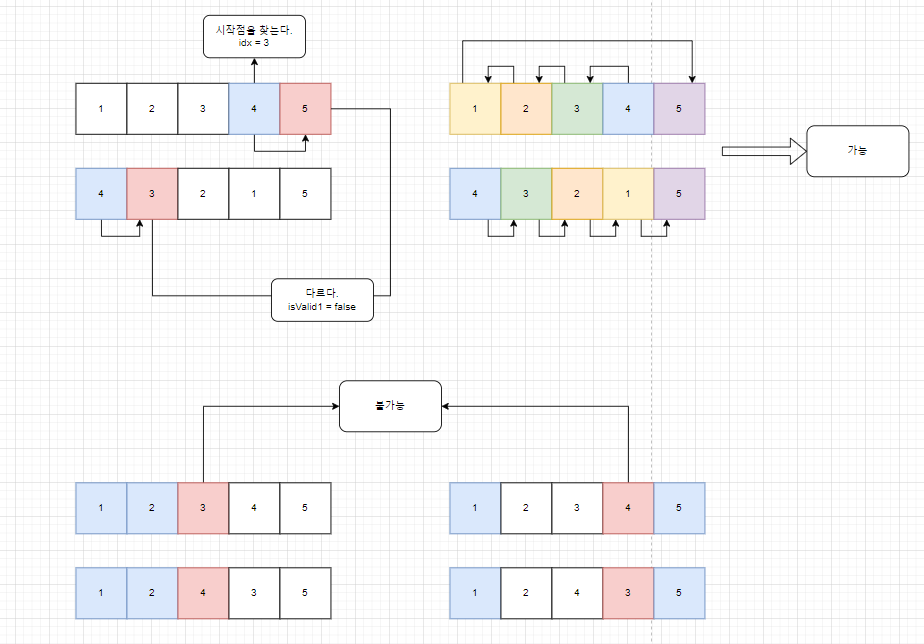

# 소스코드

```Java
import java.io.*;
import java.util.Arrays;
import java.util.StringTokenizer;

public class Main {
    public static void main(String[] args) throws IOException {
        BufferedReader br = new BufferedReader(new InputStreamReader(System.in));
        BufferedWriter bw = new BufferedWriter(new OutputStreamWriter(System.out));
        StringBuilder sb = new StringBuilder();

        int n = Integer.parseInt(br.readLine());

        int[] arr1 = new int[n];
        int[] arr2 = new int[n];
        StringTokenizer st = new StringTokenizer(br.readLine());
        for (int i = 0; i < n; i++) {
            arr1[i] = Integer.parseInt(st.nextToken());
        }

        st = new StringTokenizer(br.readLine());
        for (int i = 0; i < n; i++) {
            arr2[i] = Integer.parseInt(st.nextToken());
        }

        boolean isValid1 = true;
        boolean isValid2 = true;
        int start = arr2[0];
        int idx = 0;

        //시작점 찾기
        while (start != arr1[idx]) {
            idx++;
        }
        //그대로 확인해보기 (앞에서 뒤로)
        for (int i = 0; i < n; i++) {
            if (arr2[i] != arr1[(idx + i) % n]) {
                isValid1 = false;
                break;
            }
        }

        //뒤집고 확인해보기 (뒤에서 앞으로)
        for (int i = 0; i < n; i++) {
            if (arr2[i] != arr1[(idx - i + n) % n]) {
                isValid2 = false;
            }
        }

        sb.append(isValid1 | isValid2 ? "good puzzle" : "bad puzzle");
        bw.write(sb.toString());
        bw.flush();
        bw.close();
    }
}
```

# 소요시간

25분

# 알고리즘

# 풀이

구현

# BOJ 15501 부당한 퍼즐

# 기본 로직



1. 여러번 뒤집고 밀고를 할 필요가 없다!. (시작점만 찾고 밀면(그냥 밀고, 뒤집어서 밀고) 된다.)
2. 만들려는 수열의 첫 시작 번호를 원본배열에서 찾아 인덱스를 저장한다.
3. 해당 인덱스로부터 뒤로 쭉 읽으며 달라지는 부분이 있다면 isValid1을 false로 해준다.
4. 뒤집은 경우를 확인하기 위해 해당 인덱스로 부터 앞으로 쭉 읽으며 달라지는 부분이 있다면 isValid2를 false로 해준다.

---

## 테크닉

1. 양쪽이 이어진 원형배열에서의 인덱스 참조 방법  
   -> arr1[(idx + i) % n]
2. 이를 반대로 참조한다면  
   -> arr1[(idx - i + n) % n] (n을 더해주면 된다!.)

---
