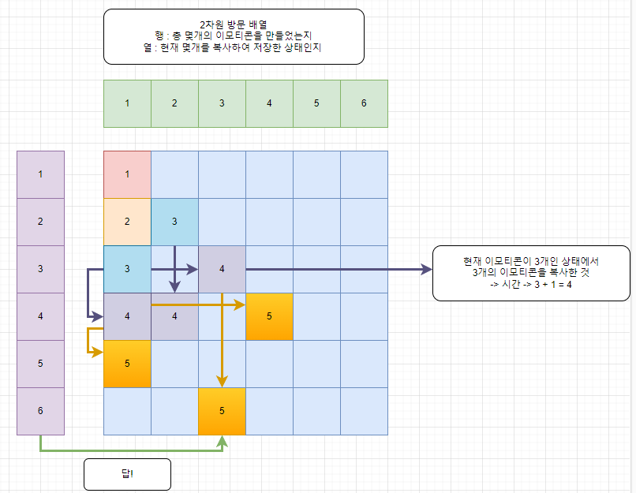

# 소스코드

```Java
import java.io.BufferedReader;
import java.io.IOException;
import java.io.InputStreamReader;
import java.util.ArrayDeque;
import java.util.Queue;

public class Main {
    public static void main(String[] args) throws IOException {
        BufferedReader br = new BufferedReader(new InputStreamReader(System.in));
        int S = Integer.parseInt(br.readLine());
        System.out.println(bfs(S));
    }

    private static int bfs(int S) {
        int result = 0;
        boolean[][] isv = new boolean[S + 1][S + 1];
        Queue<Pair> queue = new ArrayDeque<>();
        isv[1][1] = true;
        queue.offer(new Pair(1, 1, 1));
        while (!queue.isEmpty()) {
            Pair p = queue.poll();

            if (p.total == S) {
                result = p.time;
                break;
            }

            int cur = p.total + p.copy;
            if(cur <= S && !isv[cur][p.copy]){
                isv[cur][p.copy] = true;
                queue.offer(new Pair(cur, p.copy, p.time + 1));
            }
            if(p.total <= S && !isv[p.total][p.total]){
                isv[p.total][p.total] = true;
                queue.offer(new Pair(p.total, p.total, p.time + 1));
            }
            if(p.total > 1 && !isv[p.total - 1][p.copy]){
                isv[p.total - 1][p.copy] = true;
                queue.offer(new Pair(p.total - 1, p.copy, p.time + 1));
            }
        }
        return result;
    }
}

class Pair{
    int total, copy, time;

    public Pair(int total, int copy, int time) {
        this.total = total;
        this.copy = copy;
        this.time = time;
    }
}
```

# 소요시간

2시간

# 알고리즘

> BFS

# 풀이

# BOJ 14226 이모티콘

# 접근 방식 (서영, 수빈 누나의 도움)

1. 해당 문제는 선택지 3개
   1. 복사하기
   2. 붙여넣기
   3. 1개 지우기
2. 모든 연산은 1초 (가중치 없음)
3. 최솟값 (최단거리)
4. 위의 조건에 따라 BFS를 통해 문제를 해결한다.

# 기본 로직




1. 2차원 방문 배열을 만든다.
2. Queue를 이용하여 BFS를 수행하며, BFS를 사용하므로 가장 먼저 S개를 만들면 종료한다. (가중치 없는 최단 경로 문제)
3. 3가지 조건을 통해 가능한 경우에만 BFS를 수행하도록 한다.
   1. 기본적으로 이미 처리한 경우는 다시 처리하지 않는다. (이전에 처리된 경우는 나보다 더 최적경로이므로)
   2. 현재 개수 + 복사한 개수 <= S (복사한 이모티콘을 붙여넣기)
   3. 현재 개수 <= S (현재 개수를 복사하기)
   4. 현재 개수 > 1 (현재 개수 - 1)

---
