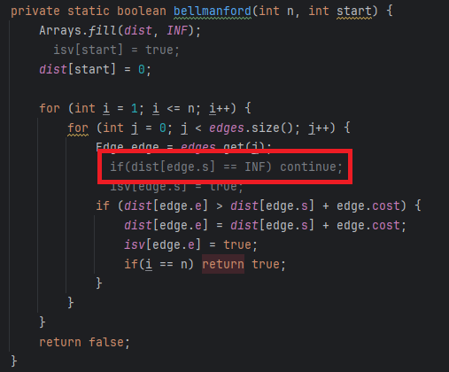

# 소스코드

```Java
import java.io.*;
import java.util.ArrayList;
import java.util.Arrays;
import java.util.StringTokenizer;

public class Main {
    static ArrayList<Edge> edges;

    static int[] dist;
    static boolean[] isv;
    static BufferedReader br = new BufferedReader(new InputStreamReader(System.in));
    static BufferedWriter bw = new BufferedWriter(new OutputStreamWriter(System.out));
    static final int INF = 10000;
    public static void main(String[] args) throws IOException {

        int T = Integer.parseInt(br.readLine());

        StringBuilder sb = new StringBuilder();
        for (int i = 0; i < T; i++) {
            StringTokenizer st = new StringTokenizer(br.readLine());
            int N = Integer.parseInt(st.nextToken());
            int M = Integer.parseInt(st.nextToken());
            int W = Integer.parseInt(st.nextToken());
            sb.append(solve(N, M, W) ? "YES" : "NO").append("\n");
        }
        bw.write(sb.toString());
        bw.flush();
        bw.close();
    }

    private static boolean solve(int n, int m, int w) throws IOException {
        edges = new ArrayList<Edge>();
        dist = new int[n + 1];
        isv = new boolean[n + 1];

        for (int i = 0; i < m + w; i++) {
            StringTokenizer st = new StringTokenizer(br.readLine());
            int s = Integer.parseInt(st.nextToken());
            int e = Integer.parseInt(st.nextToken());
            int c = Integer.parseInt(st.nextToken());
            if(i < m) {
                edges.add(new Edge(s, e, c));
                edges.add(new Edge(e, s, c));
            } else {
                edges.add(new Edge(s, e, -c));
            }
        }
        for (int i = 1; i <= n; i++) {
            if(isv[i]) continue;
            if(bellmanford(n, i)) return true;
        }
        return false;
    }

    private static boolean bellmanford(int n, int start) {
        Arrays.fill(dist, INF);
        isv[start] = true;
        dist[start] = 0;

        for (int i = 1; i <= n; i++) {
            for (int j = 0; j < edges.size(); j++) {
                Edge edge = edges.get(j);
                if(dist[edge.s] == INF) continue;
                isv[edge.s] = true;
                if (dist[edge.e] > dist[edge.s] + edge.cost) {
                    dist[edge.e] = dist[edge.s] + edge.cost;
                    isv[edge.e] = true;
                    if(i == n) return true;
                }
            }
        }
        return false;
    }
}

class Edge{
    int s, e, cost;

    public Edge(int s, int e, int cost) {
        this.s = s;
        this.e = e;
        this.cost = cost;
    }
}
```

# 소요시간

2시간

# 알고리즘

> 벨만포드

# 풀이

# BOJ 1865 웜홀

# 기본 로직

1. 도로는 양방향 양의 가중치, 웜홀은 단방향 음의 가중치를 가진다.
2. 음의 가중치가 있는 경우에는 벨만포드 or 플로이드 와샬 알고리즘을 사용해야 하므로, 안해본 벨만포드 알고리즘을 사용
3. 벨만포드 알고리즘을 통해 음수 사이클을 확인한다.  
   음수 사이클이 존재하면 YES -> 왜냐하면, 이미 방문한 곳을 다시 방문해도 되므로 음수 사이클 존재 시 무조건 과거로 돌아갈 수 있음.

---

## 주의사항 및 놓친 점



1. 문제를 잘 읽자 ( `단 도로는 방향이 없으며 웜홀은 방향이 있다.` )
2. 연결되지 않은 정점이 있을 수 있으므로 시작점을 하나의 정점으로 고정시키면 해당 정점에 연결되지 않은 정점들은 탐색할 수 없다.  
    -> 만약, 임의의 시작점에 연결되지 못해서 탐색하지 못한 정점들 간에 음수 사이클 존재 시 답 : YES, but, 출력 : NO가 된다.
   > 음수사이클을 판단하는 이유 : 방문한 곳을 다시 방문해도 되고, 음수 사이클을 타면 가중치가 -무한대로 발산하므로 어떻게든 과거로 돌아갈 수 있음.
3. 따라서, isv를 통해 탐색이 전혀 수행되지 않은 정점들을 이용하여 다시 탐색해보는 로직을 추가해주었다.
4. 아니면 위의 이미지처럼 dist[edge.s] = INF이더라도(현재 정점에서 이동할 수 없는 경우) 최단경로 갱신을 수행한다. (왜 되는지는 모르겠움..)  
   저는 직관적으로 보이는 isv를 사용하고 못가는 경우는 못간다는 처리를 해주는 것이 더 이해하기 편했던 것 같습니다.

---
