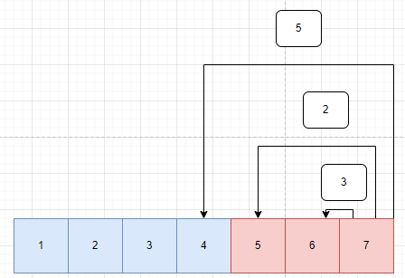
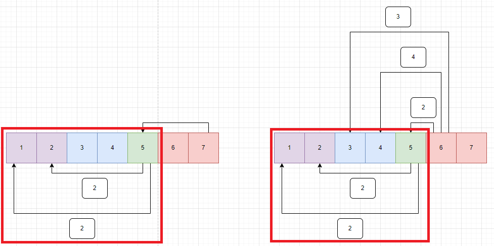

# 소스코드

```Java
package com.javajava.week13;

import java.io.*;
import java.util.ArrayList;
import java.util.List;
import java.util.StringTokenizer;

public class BOJ2637 {
    static int[][] counts;
    static boolean[] isv;
    static List<int[]>[] adjList;
    static int N;
    public static void main(String[] args) throws IOException {
        BufferedReader br = new BufferedReader(new InputStreamReader(System.in));
        BufferedWriter bw = new BufferedWriter(new OutputStreamWriter(System.out));
        StringBuilder sb = new StringBuilder();

        N = Integer.parseInt(br.readLine());
        int M = Integer.parseInt(br.readLine());

        isv = new boolean[N + 1];
        counts = new int[N + 1][N + 1];
        adjList = new ArrayList[N + 1];
        for (int i = 0; i <= N; i++) {
            adjList[i] = new ArrayList<>();
        }

        for (int i = 0; i < M; i++) {
            StringTokenizer st = new StringTokenizer(br.readLine());
            int X = Integer.parseInt(st.nextToken());
            int Y = Integer.parseInt(st.nextToken());
            int K = Integer.parseInt(st.nextToken());
            adjList[X].add(new int[]{Y, K});
        }
        dfs(N, 1, 0);
        for (int i = 1; i <= N; i++) {
            if(adjList[i].isEmpty()) sb.append(i).append(" ").append(counts[N][i]).append("\n");
        }
        bw.write(sb.toString());
        bw.flush();
        bw.close();
    }

    private static void dfs(int n, int cnt, int pre) {
        if (adjList[n].isEmpty()) {
            counts[pre][n] += cnt;
            return;
        }
        for (int i = 0; i < adjList[n].size(); i++) {
            int[] next = adjList[n].get(i);
            if(!isv[next[0]]) dfs(next[0], next[1], n);
            for (int j = 1; j <= N; j++) {
                counts[n][j] += counts[next[0]][j] * next[1];
            }
        }
        isv[n] = true;
    }
}
```

# 소요시간

2시간

# 알고리즘

> DFS, DP

# 풀이

# BOJ 2637 장난감 조립

# 기본 로직




1. N을 만들기위해서 기본 부품의 개수를 찾을 때 까지 DFS한다.
2. dfs(완제품 번호, 1개 만든다, 이전 부품 번호)로 골격을 짠다.
   1. 완제품을 만들기 위해 필요한 중간 부품들을 adjList에 넣어둔다.
   2. 기저조건은 기본 부품일 때로 설정하고, 2번째 매개변수로 몇개를 만들지 준다.        
   >6을 만들기 위해 5개 2개 필요하다면?     
   > -> 5(1 2개 2 2개)가 2개 필요하다.      
   > 이를 간단하게, 필요한 개수를 곱해서 다음 dfs로 넘겨준다.
   3. 만약 dfs가 끝나면? 해당 제품을 만들기 위한 기본 부품의 개수를 모두 구한것이므로,      
   isv[] = true로 설정한다.
3. 중간 부품이 다른 중간 부품을 필요로 하기 때문에 바텀 업 방식으로 구현하여            
   가장 기본 부품에 가까운 기본 부품을 최대한 사용하는     
   -> `중간 부품이 중간 부품들의 모음으로 이루어진 경우의 반대`  
   부품을 먼저 구한다.
4. 중간 부품이 어떤 기본 부품을 몇개 필요로 하는지를 저장하기 위해 2차원 배열을 사용한다.
   > 7 -> 5개 2개 필요, 6 -> 2개 필요한 상황에
   > 7에서 5의 기본 부품의 조합을 찾았다!.
   > 6에서 5의 기본 부품을 또 찾는 것은 비효율적! (시간초과의 원인)
   > 조합만 찾고 이를 재사용하자 (메모이제이션)
5. 하나의 중간 부품에 필요한 기본 부품 조합을 찾은 것을 해당 중간 부품을 필요로해서 호출한 이전 중간 부품에 더해준다.
6. 최종적으로는 N을 만드는데 필요한 기본 부품의 개수가 counts[N][1~N-1]에 들어있다.
7. 여기서 adjList[i].isEmpty()인 경우(다른 부품을 사용하지 않으므로) 기본 부품이므로 이를 출력한다.
---
