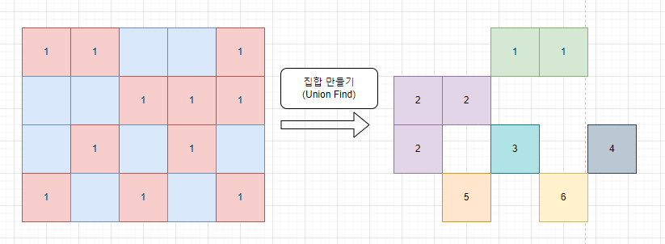
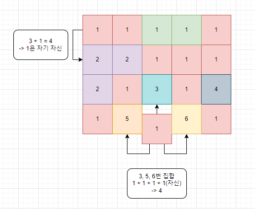

# 소스코드

```Java
package com.javajava.week14;

import java.io.*;
import java.util.*;

public class BOJ16946 {
    static int[][] map, resultMap;
    static int N, M;
    static int[] dx = {-1, 0, 1, 0}, dy = {0, -1, 0, 1};

    public static void main(String[] args) throws IOException {
        BufferedReader br = new BufferedReader(new InputStreamReader(System.in));
        BufferedWriter bw = new BufferedWriter(new OutputStreamWriter(System.out));

        StringTokenizer st = new StringTokenizer(br.readLine());
        N = Integer.parseInt(st.nextToken());
        M = Integer.parseInt(st.nextToken());
        map = new int[N][M];
        resultMap = new int[N][M];
        List<Pair> walls = new ArrayList<Pair>();
        UnionFind uf = new UnionFind(N, M);

        for (int i = 0; i < N; i++) {
            String input = br.readLine();
            for (int j = 0; j < M; j++) {
                map[i][j] = input.charAt(j) - '0';
                if (map[i][j] == 1) {
                    walls.add(new Pair(i, j));
                    continue;
                }

                //현재 좌표 기준 왼쪽, 위쪽은 이미 집합에 속한 상태(해당 집합은 혼자만 속했을수도 있음)
                //넘위를 넘어가지 않고 1이 아니라면 나와 연결될 수 있음. union연산으로 집합에 추가
                for (int k = 0; k < 2; k++) {
                    int nx = i + dx[k];
                    int ny = j + dy[k];
                    if(validate(nx, ny)) continue;
                    uf.union(new int[]{nx, ny}, new int[]{i, j});
                }
            }
        }
        //모든 벽에 대해서 수행
        for (Pair wall : walls) {
            Set<Pair> set = new HashSet<Pair>();
            //벽의 4방향을 확인해서 4방향의 집합을 set에 저장
            //set에 저장하는 이유 : 4방향 중 일부 혹은 전체가 같은 집합일 경우
            //갈 수 있는 위치 수가 중복해서 더해지므로
            for (int i = 0; i < 4; i++) {
                int nx = wall.x + dx[i];
                int ny = wall.y + dy[i];
                if(validate(nx, ny)) continue;
                int[] res = uf.find(new int[]{nx, ny});
                set.add(new Pair(res[0], res[1]));
            }
            int cnt = 1;
            for (Pair pair : set) {
                cnt += uf.rank[pair.x][pair.y];
            }
            resultMap[wall.x][wall.y] = cnt % 10;
        }

        StringBuilder sb = new StringBuilder();
        for (int i = 0; i < N; i++) {
            for (int j = 0; j < M; j++) {
                sb.append(resultMap[i][j]);
            }
            sb.append("\n");
        }
        bw.write(sb.toString());
        bw.flush();
        bw.close();
    }

    private static boolean validate(int nx, int ny) {
        return nx < 0 || ny < 0 || nx >= N || ny >= M || map[nx][ny] == 1;
    }
}
//2차원 유니온 파인드 클래스
class UnionFind{
    int[][][] parents;
    int[][] rank;

    public UnionFind(int N, int M) {
        this.parents = new int[N][M][2];
        this.rank = new int[N][M];

        for (int i = 0; i < N; i++) {
            for (int j = 0; j < M; j++) {
                parents[i][j] = new int[]{i, j};
                rank[i][j] = 1;
            }
        }
    }

    public int[] find(int[] v) {
        if(equals(parents[v[0]][v[1]], v)) return v;
        return parents[v[0]][v[1]] = find(parents[v[0]][v[1]]);
    }

    public boolean union(int[] v, int[] u) {
        int[] rep1 = find(v);
        int[] rep2 = find(u);

        if(equals(rep1, rep2)) return false;

        //한쪽으로 몰기
        if (rank[rep1[0]][rep1[1]] > rank[rep2[0]][rep2[1]]) {
            parents[rep1[0]][rep1[1]] = rep2;
            rank[rep2[0]][rep2[1]] += rank[rep1[0]][rep1[1]];
            rank[rep1[0]][rep1[1]] = 0;
            return true;
        }
        parents[rep2[0]][rep2[1]] = rep1;
        rank[rep1[0]][rep1[1]] += rank[rep2[0]][rep2[1]];
        rank[rep2[0]][rep2[1]] = 0;
        return true;
    }

    //x, y좌표가 같은지 확인하는 메서드
    public boolean equals(int[] arr1, int[] arr2) {
        if(arr1[0] == arr2[0] && arr1[1] == arr2[1]) return true;
        return false;
    }
}

class Pair{
    int x, y;

    public Pair(int x, int y) {
        this.x = x;
        this.y = y;
    }

    @Override
    public boolean equals(Object o) {
        if (this == o) return true;
        if (o == null || getClass() != o.getClass()) return false;
        Pair pair = (Pair) o;
        return x == pair.x && y == pair.y;
    }

    @Override
    public int hashCode() {
        return Objects.hash(x, y);
    }
}
```

# 소요시간

1시간 20분

# 알고리즘

> 유니온 파인드

# 풀이

# BOJ 16946 벽 부수고 이동하기 4

# 기본 로직




1. 입력을 받으면서 Union Find를 통해 집합을 생성한다.
2. 현재 입력받는 좌표 기준 왼쪽, 위쪽은 이미 집합을 구성한 상태이므로  
   왼, 위 2개의 좌표와 union을 수행한다.
3. 또한, 입력을 받으며 벽인 경우 List에 이를 저장해둔다.
4. 모든 집합을 만들었으면 (입력이 종료되면) 저장해둔 List를 통해 아래의 과정을 수행한다.
   1. List에서 벽 좌표 1개를 가져온다.
   2. 해당 벽을 기준으로 상, 하, 좌, 우의 좌표의 대표자를 찾는다. (find)
   3. 찾은 대표자를 Set에 저장한다.
      > Set에 저장하는 이유 : 대표자가 같은 경우도 그냥 넣으면 중복해서 더해진다!.
   4. Set에 저장된 대표자의 rank를 가져와서 이를 resultMap의 좌표에 더해준다.

---
