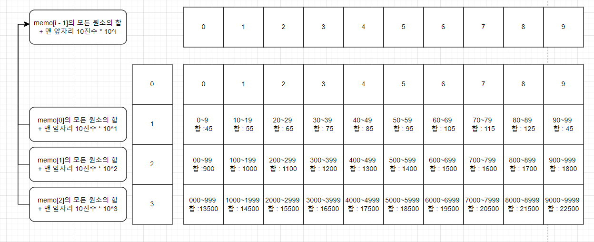
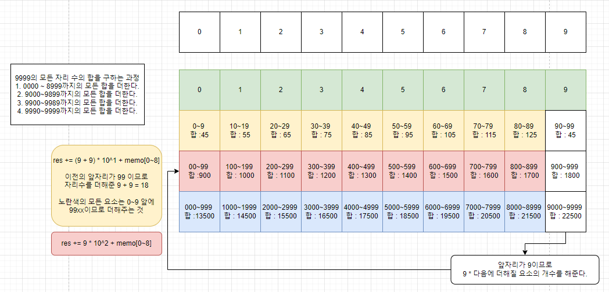

# 소스코드

```Java
import java.io.BufferedReader;
import java.io.IOException;
import java.io.InputStreamReader;
import java.util.StringTokenizer;

public class Main {
    static long[][] memo;
    static long[] digits;
    public static void main(String[] args) throws IOException {
        BufferedReader br = new BufferedReader(new InputStreamReader(System.in));
        StringTokenizer st = new StringTokenizer(br.readLine());
        long L = Long.parseLong(st.nextToken());
        //0일때는 안빼주기 위해서 (R - L -> L+1 ~ R이므로)
        String StringL = L == 0 ? "0" : String.valueOf(L - 1);
        String StringR = st.nextToken();

        int len = StringR.length();
        memo = new long[len + 1][10];
        digits = new long[len + 1];
        for (int i = 0; i < 10; i++) {
            memo[0][i] = i;
        }
        digits[1] = 45;
        for (int i = 1; i <= len; i++) {
            digits[i] = (digits[i - 1] * 10) + 45 * (long) Math.pow(10, i - 1);
            /**
             * [1][0] 0 ~9 : 45
             * [1][1] 10~19 : 45 + 1 * 10, 20 ~ 29 : 45 + 2 * 10
             * [1][9]0~99 : 45 + 10 + 45 + 20 + ... 45 + 90 = 45 * 10 + (1+2+..+9) * 10^1
             * [2][0] = SUM(digits[2 - 1][0~9])
             */
            for (int j = 0; j < 10; j++) {
                memo[i - 1][j] = digits[i - 1] + j * (long) Math.pow(10, i - 1);
            }
        }

        long l = calcRes(StringL);
        long r = calcRes(StringR);
        long res = r - l;
        System.out.println(res);
    }

    private static long calcRes(String string) {
        int len = string.length();
        int pre = 0;
        long res = 0;
        int dec = 0;
        for (int i = 0; i < len; i++) {
            //현재 자리의 10진수 수
            dec = string.charAt(i) - '0';
            //9이면 0~8까지 더함
            for (int j = 0; j < dec; j++) {
                //9999이면 (j = 0) 0000~999 + (j = 1) 1000~1999 + ...(j = 8) 8000 ~ 8999의 합 -> 0 ~ 8999까지 각 자리의 모든 합
                //9000~9099 + 9100~9199 + ... + 9800 ~ 9899 => 이때 000~099 + 100~199 + ... + 800~899의 미리 구해둔 합 (memo[3][0~8]사용)
                //이때 맨 앞의 자리가 9이고 0~99는 수의 개수가 100이므로 9 * 10^2을 해주어야 한다.
                res += memo[len - i - 1][j] + (pre * (long) Math.pow(10, len - i - 1));
            }
            pre += dec;
        }
        //0~8까지 더하게 되면 9998까지 구해진 것이므로 R자신의 수가 안더해짐
        //R의 모든 자리의 합 : pre가 된다. (pre += dec로 인해)
        return res + pre;
    }
}
```

# 소요시간

삽질 약 5시간

# 알고리즘

> 구현

# 풀이

# BOJ 1081 합

> 미리 해당 수를 만들때 필요한 수들의 합을 구해둔다.
> 

1. 미리 구해둔 수들의 합을 통해 최종적으로 목적인 수를 만드는 것
2. 예를들어 9999는
   1. 0000~0999 + 1000~1999 + ... + 8000~8999 +
   2. (9)000~099 + 100~199 + ... + 800~899 +
   3. (99)00~09 + 10~19 + ... + 80~89 +
   4. (999) 0 + 1 + ... + 9 이다.
3. 내가 원하는 수를 만들기 위해서 2, 3, 4번 작업부터는 이전의 앞자리를 그대로 더해주어야 한다.
   > 9900~9909 -> 9+9 \* 10^1 => 즉, 이전의 합을 해당 되는 요소의 개수만큼 곱한 것
4. 이렇게 더해가면 최종적으로 R을 제외한 모든 수가 구해지게 된다.  
   (ex. R = 9999이면 9998까지 구해짐)
5. 이때 R의 자리의 합 : pre가 된다. (pre += dec로 인해)
6. 이에 대한 작업을 L - 1, R에 대해 모두 수행하고 R - (L-1)을 해준다.
   > 

---
