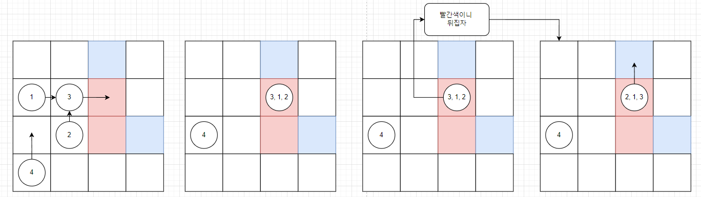
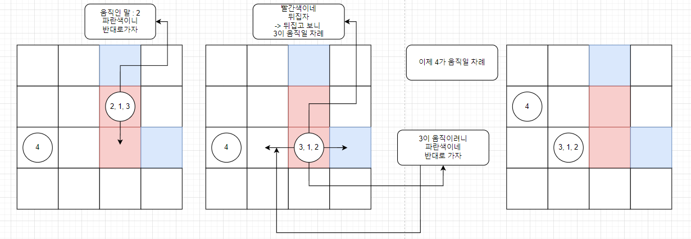

# 소스코드

```Java
import java.io.BufferedReader;
import java.io.IOException;
import java.io.InputStreamReader;
import java.util.*;

/**
 * 말 1~K 이동방향 fix
 * 흰 : 그냥 이동 (이미 그 자리에 있으면 이동하는 말을 해당 말 위로 올림)
 * 빨 : 이동 후 쌓인 말의 순서를 반대로 뒤집기
 * (이미 그 자리에 있는 경우 A, B, C순서로 이미 있으면  A, B, C + 뒤집어서 올리기)
 * 파 : 반대 방향으로 한칸 이동 (반대 방향도 파란색이면 방향만 바꾸기)
 * 말이 4개이상 쌓이면 종료
 * 절대 끝나지 않는 경우 -1 (or 턴이 1000이상이면)
 */
public class Main {
    static int[][] map;
    static int[] dx = {0, 0, 0, -1, 1};
    static int[] dy = {0, 1, -1, 0, 0};
    static int N, K;

    //각각의 말 위치 관리 Map
    static Map<String, ArrayList<Piece>> pieces;
    static int cnt;

    public static void main(String[] args) throws IOException {
        BufferedReader br = new BufferedReader(new InputStreamReader(System.in));
        StringTokenizer st = new StringTokenizer(br.readLine());
        cnt = 0;
        N = Integer.parseInt(st.nextToken());
        K = Integer.parseInt(st.nextToken());

        map = new int[N + 1][N + 1];
        for (int i = 1; i <= N; i++) {
            st = new StringTokenizer(br.readLine());
            for (int j = 1; j <= N; j++) {
                map[i][j] = Integer.parseInt(st.nextToken());
            }
        }

        pieces = new HashMap<>();
        PriorityQueue<Piece> queue = new PriorityQueue<>();
        for (int i = 0; i < K; i++) {
            st = new StringTokenizer(br.readLine());
            int x = Integer.parseInt(st.nextToken());
            int y = Integer.parseInt(st.nextToken());
            int dir = Integer.parseInt(st.nextToken());
            Piece piece = new Piece(i, x, y, dir);
            queue.offer(piece);
            ArrayList<Piece> list = new ArrayList<>();
            list.add(piece);
            pieces.put(makeKey(x, y), list);
        }

        int turn = 0;
        while (turn++ < 1000) {
            Queue<Piece> nextQ = simulation(queue);
            PriorityQueue<Piece> pq = new PriorityQueue<>();
            if (nextQ == null) break;
            while (!nextQ.isEmpty()) {
                pq.offer(nextQ.poll());

            }
            queue = pq;
        }
        System.out.println(turn > 1000 ? -1 : turn);
    }

    private static Queue<Piece> simulation(PriorityQueue<Piece> queue) {
        Queue<Piece> nextQ = new ArrayDeque<>();
        while (!queue.isEmpty()) {
            Piece piece = queue.poll();

            int nx = piece.x + dx[piece.dir];
            int ny = piece.y + dy[piece.dir];

            if (boundaryCheck(nx, ny)) { //경계밖 or 파
                //방향 바꾸기
                if (piece.dir == 1 || piece.dir == 3) {
                    piece.dir += 1;
                } else {
                    piece.dir -= 1;
                }
                int nx2 = piece.x + dx[piece.dir];
                int ny2 = piece.y + dy[piece.dir];

                if (boundaryCheck(nx2, ny2)) {
                    continue;
                    //못움직임 (반대로 바꿔도 못갈때)
                    //pieces.remove(makeKey(piece.x, piece.y));
                } else {
                    move(queue, nextQ, piece, nx2, ny2);
                }
                continue;
            }
            move(queue, nextQ, piece, nx, ny);
        }
        if (nextQ.isEmpty() || cnt >= 4) return null;
        return nextQ;
    }

    private static void move(PriorityQueue<Piece> queue, Queue<Piece> nextQ, Piece piece, int x, int y) {
        ArrayList<Piece> list = pieces.get(makeKey(x, y));
        //현재 위치 삭제
        ArrayList<Piece> current = pieces.remove(makeKey(piece.x, piece.y));
        piece.x = x;
        piece.y = y;

        if (map[x][y] == 0) { //흰
            if (list != null) { //이미 있는 경우
                //추가 (큐에는 맨 아래 피스가 있으므로 추가X)
                for (Piece p : current) {
                    list.add(new Piece(p.idx, x, y, p.dir));
                }
                cnt = Math.max(cnt, list.size());
            } else {
                //현재 위치에 없는 경우
                pieces.put(makeKey(x, y), current);
                nextQ.offer(piece);
            }
        } else if (map[x][y] == 1) { //빨
            if (list != null) {
                //현재 노드의 리스트를 뒤집어서 이동하려는 위치의 리스트에 추가
                ArrayList<Piece> reverse = new ArrayList<>(current);
                for (int i = reverse.size() - 1; i >= 0; i--) {
                    Piece p = reverse.get(i);
                    list.add(new Piece(p.idx, x, y, p.dir));
                }
                cnt = Math.max(cnt, list.size());
            } else {
                ArrayList<Piece> reverse = new ArrayList<>();
                for (int i = current.size() - 1; i >= 0; i--) {
                    Piece p = current.get(i);
                    reverse.add(new Piece(p.idx, x, y, p.dir));
                }
                //현재 위치에 없는 경우
                pieces.put(makeKey(x, y), reverse);
                //뒤집었을 때 뒤집은 애가 나보다 순서가 느리면 얘도 움직이게 해야한다.
                // 1-2-3 에서 1을 움직여서 뒤집힘 -> 3-2-1에서 3도 움직여야함. (근데 계속 1->3-1->3이 되면 4는 못움직임)
                if(reverse.get(0).idx > piece.idx) queue.offer(reverse.get(0));
                else nextQ.offer(reverse.get(0));
            }
        }
    }

    private static boolean boundaryCheck(int x, int y) {
        return x < 1 || y < 1 || x > N || y > N || map[x][y] == 2;
    }

    private static String makeKey(int x, int y) {
        return x + "_" + y;
    }
}

class Piece implements Comparable<Piece> {
    int idx, x, y, dir;

    public Piece(int idx, int x, int y, int dir) {
        this.idx = idx;
        this.x = x;
        this.y = y;
        this.dir = dir;
    }

    @Override
    public int compareTo(Piece o) {
        return Integer.compare(this.idx, o.idx);
    }
}
```

# 소요시간

4시간

# 알고리즘

> 시뮬레이션

# 풀이

# BOJ 17780 새로운 게임

1. Priority Queue를 사용하여 말을 순서대로 이동시키도록 한다. (Piece 클래스의 idx 필드를 사용)

2. PQ에서 모든 요소를 하나씩 빼면서 이동을 시작한다.

3. 이동하려는 위치에 현재 Piece의 x_y 좌표를 String 키로 만들어 Map 자료구조에 관리한다 (value = ArrayList)  
   ArrayList에는 겹쳐진 말들을 순서대로 관리한다.

4. 이동하려는 위치가 파란색이거나 경계 밖이라면 아래의 과정을 수행한다.

   1. Piece의 dir을 반대로 변경하고 이동하려는 곳의 색을 확인한다.

   2. 만약 파란색 or 경계 밖이라면 이동하지 않는다. (더 이상 이동할 수 없는 경우이므로 큐에 추가하지 않는다.)

      > 주의 : 큐에 추가하지 않는 것이지 Map상에서 삭제하지 않는다.  
      > 왜냐하면 나중에 다른 말이 해당 위치로 겹쳐질 수 있으므로 말이 4개이상 겹쳐진 케이스를 체크해주어야 하므로  
      > (내가 실수한 부분 -> 못 움직일 때 Map에서 삭제했다..)

   3. 이동하려는 곳이 흰색이라면
      1. 현재 위치의 x_y에 대응되는 ArrayList를 Map에서 삭제하고,
      2. 이동하는 위치에 말이 없다면 새롭게 키를 nx_ny로 ArrayList를 그대로 옮겨준다.
      3. 만약 이미 해당 위치에 다른 말이 존재하면 뒤에 리스트를 붙혀준다.
   4. 이동하려는 곳이 빨간색이라면
      1. 현재 위치의 x_y에 대응되는 ArrayList를 Map에서 삭제하고,
      2. 이동 하려는 위치에 말이 없다면 새롭게 키를 nx_ny로 ArrayList를 뒤집어서 넣어준다.
      3. 만약 이미 해당 위치에 다른 말이 존재하면 뒤집은 리스트를 원래 해당 위치의 리스트에 붙혀준다.

5. 이동하려는 곳이 흰색이라면

   1. 현재 위치의 x_y에 대응되는 ArrayList를 Map에서 삭제하고,
   2. 이동하는 위치에 말이 없다면 새롭게 키를 nx_ny로 ArrayList를 그대로 옮겨준다.
   3. 만약 이미 해당 위치에 다른 말이 존재하면 뒤에 리스트를 붙혀준다.

6. 이동하려는 곳이 빨간색이라면
   1. 현재 위치의 x_y에 대응되는 ArrayList를 Map에서 삭제하고,
   2. 이동 하려는 위치에 말이 없다면 새롭게 키를 nx_ny로 ArrayList를 뒤집어서 넣어준다.
   3. 만약 이미 해당 위치에 다른 말이 존재하면 뒤집은 리스트를 원래 해당 위치의 리스트에 붙혀준다.

# 주의 사항

### `Turn1`



### `Turn2` (중요)



> 1->2->3 순서로 쌓인 경우 1번을 움직여서 빨간색 도착 시  
> 뒤집히면 3->2->1이므로 3번 말도 움직여줘야 한다.  
> 말은 순서대로 움직이므로 1이 움직이면 다음은 2이지만  
> 못움직이는 상태이므로 패스 3은 위에서 맨 아래로 왔으니 움직일 수 있으므로 움직인다.

---
