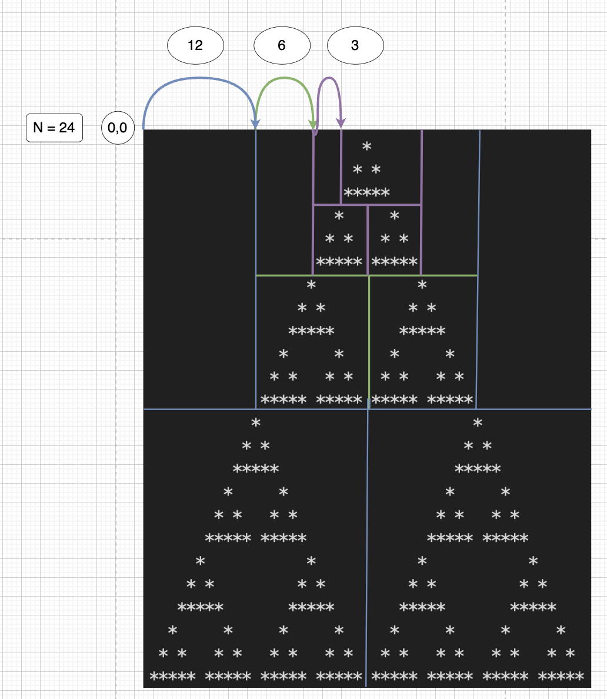

# 소스코드

```Java
package com.javajava.week19;

import java.io.BufferedReader;
import java.io.BufferedWriter;
import java.io.IOException;
import java.io.InputStreamReader;
import java.io.OutputStreamWriter;

public class BOJ2448 {
    static char[][] map;
    static char[][] triangle = {
        {' ', ' ', '*', ' ', ' '},
        {' ', '*', ' ', '*', ' '},
        {'*', '*', '*', '*', '*'}
    };
    public static void main(String[] args) throws IOException {
        BufferedReader br = new BufferedReader(new InputStreamReader(System.in));
        BufferedWriter bw = new BufferedWriter(new OutputStreamWriter(System.out));

        int N = Integer.parseInt(br.readLine());
        //3 * 2^10 = 1024 * 3 = 3072 (행)
        //3 * 2^10 * 2 - 6144
        map = new char[3073][6144];
        int depth = N / 3;
        draw(depth, 0, 0);

        StringBuilder sb = new StringBuilder();
        for (int i = 0; i < N; i++) {
            for (int j = 0; j < 2 * N ; j++) {
                sb.append(map[i][j] == '*' ? '*' : ' ');
            }
            sb.append("\n");
        }
        bw.write(sb.toString());
        bw.flush();
        bw.close();
    }


    //depth = 2^n 꼴 8 = 2^3 -> 3번씩 재귀 log2(n)깊이만큼 수행해야 한다.
    private static void draw(int depth, int x, int y) {
        if (depth == 1){
            for (int i = 0; i < 3; i++) {
                for (int j = 0; j < 5; j++) {
                    map[x + i][y + j] = triangle[i][j];
                }
            }
            return;
        }
        draw(depth / 2, x, y + 3 * depth / 2);
        draw(depth / 2, x + 3 * depth / 2, y);
        draw(depth / 2, x + 3 * depth / 2, y + 3 * depth);
    }
}
```

# 소요시간

3시간

# 알고리즘

> 구현

# 풀이

# BOJ 2448 별찍기-11



1. 해당 삼각형의 시작 위치를 재귀적으로 욺기며 가장 최소 단위의 삼각형이 나올 때까지 쪼갠다.
   > 초기 값을 반씩 쪼개서 현재 좌표에 더해주어 시작점을 잡아준다.  
   > 여기서 행 크기는 N, 열 크기는 2 \* N - 1이므로  
   > N = 24이면 24 / 2, 48 / 2로 반씩 나누어줘야 한다.
2. 최소 단위의 삼각형 (n==1)이면 이를 map에 복사해준다.
3. 최종적으로 출력한다.

> Z랑 비슷한 느낌인데 더 어렵다ㅏㅏㅏㅏㅏㅏ

---
