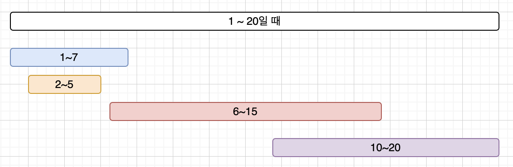

# 소스코드

```Java
import java.io.BufferedReader;
import java.io.IOException;
import java.io.InputStreamReader;
import java.util.PriorityQueue;
import java.util.StringTokenizer;

public class BOJ2170 {

    public static void main(String[] args) throws IOException {
        BufferedReader br = new BufferedReader(new InputStreamReader(System.in));
        int N = Integer.parseInt(br.readLine());
        PriorityQueue<Line> pq = new PriorityQueue<>();
        for (int i = 0; i < N; i++) {
            StringTokenizer st = new StringTokenizer(br.readLine());
            int start = Integer.parseInt(st.nextToken());
            int end = Integer.parseInt(st.nextToken());
            pq.offer(new Line(start, end));
        }

        Line first = pq.poll();
        int start = first.start;
        int end = first.end;
        int sum = 0;
        while (!pq.isEmpty()) {
            Line line = pq.poll();
            //이전과 이어지지 않으면
            if (end < line.start) {
                //이전까지의 길이의 합을 더해줌
                sum += (end - start);
                //현재 원소부터 다시 시작
                start = line.start;
                end = line.end;
                continue;
            }
            //이어지면 뒤만 갱신 (앞을 기준으로 우선순위를 줬기 때문)
            end = Math.max(end, line.end);
        }
        sum += end - start; //마지막 라인 길이 더해주기
        System.out.println(sum);
    }
}

class Line implements Comparable<Line>{
    int start, end;

    public Line(int start, int end) {
        this.start = start;
        this.end = end;
    }

    @Override
    public int compareTo(Line o) {
        if(this.start == o.start) return Integer.compare(this.end, o.end);
        return Integer.compare(this.start, o.start);
    }
}
```

# 소요시간

20분

# 알고리즘

> 그리디

# 풀이

# BOJ 2170 선 긋기

1. 선의 시작점이 작은 값부터 하나씩 확인한다.
   > 시작점이 작은 것부터 사용하기 위해 PriorityQueue에 입력값을 저장한다. (같으면 끝점이 작은 것 부터)
2. 이렇게 정렬하면 앞에서부터 이전 선과 겹치는지 (이어지는지) 그렇지 않은지에 따라 조건 분기가 가능해진다.
   
3. 이전 선과 이어지는 경우에는 끝 점만 갱신해주면 된다.
   > 이때, end = line.end로 하면 이전 선이 1~6일때 2~5이면 5로 갱신되어  
   > 최대가 아니게 되므로 둘 중 최대값으로 갱신한다.
4. 이전 선과 이어지지 않는 경우에는 이전 선의 길이를 최종 길이에 더해주고  
   시작점과 끝점을 현재 값으로 다시 세팅하고 위의 과정을 반복한다.
5. 마지막으로 갱신해둔 값은 아직 최종 값에 더해지지 않은 상태이므로 end-start를 더해준 후 출력한다.

---
