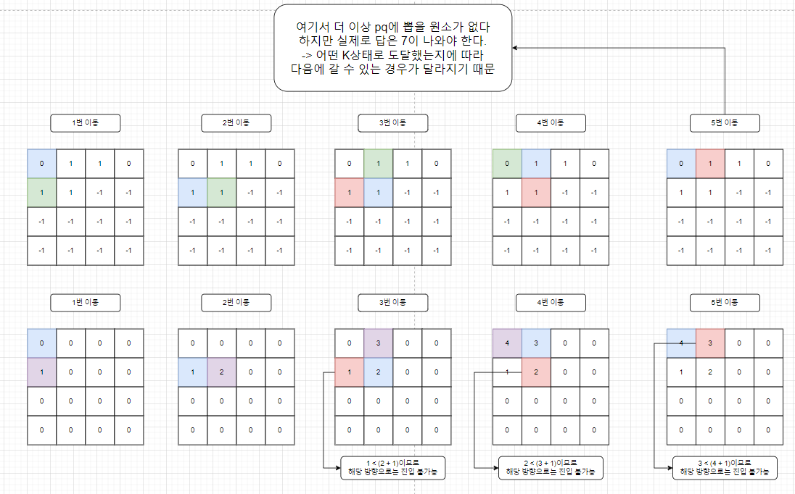
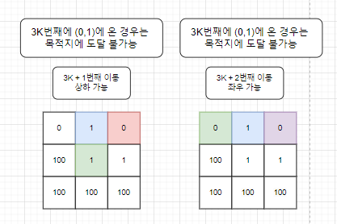
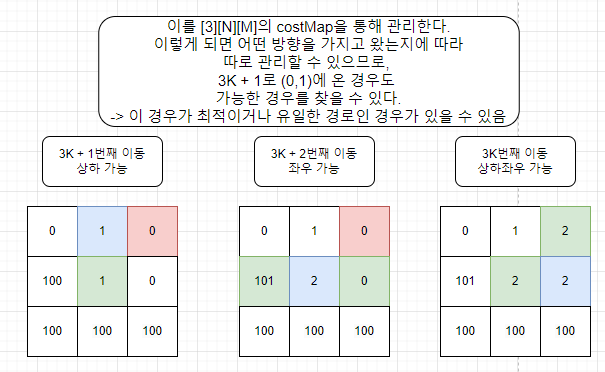

# 소스코드

```Java
package com.javajava.week22;

import java.io.BufferedReader;
import java.io.IOException;
import java.io.InputStreamReader;
import java.util.PriorityQueue;
import java.util.StringTokenizer;

public class BOJ22255 {
    static int[][] dx = {
            {-1, 1, 0, 0},
            {-1, 1},
            {0, 0}
    };
    static int[][] dy = {
            {0, 0, -1, 1},
            {0, 0},
            {-1, 1}
    };
    static int[][] map;
    static int[][][] costMap;
    static int N, M;

    public static void main(String[] args) throws IOException {
        BufferedReader br = new BufferedReader(new InputStreamReader(System.in));
        StringTokenizer st = new StringTokenizer(br.readLine());
        N = Integer.parseInt(st.nextToken());
        M = Integer.parseInt(st.nextToken());

        map = new int[N][M];
        costMap = new int[3][N][M];

        st = new StringTokenizer(br.readLine());
        int sx = Integer.parseInt(st.nextToken()) - 1;
        int sy = Integer.parseInt(st.nextToken()) - 1;
        int ex = Integer.parseInt(st.nextToken()) - 1;
        int ey = Integer.parseInt(st.nextToken()) - 1;
        for (int i = 0; i < N; i++) {
            st = new StringTokenizer(br.readLine());
            for (int j = 0; j < M; j++) {
                map[i][j] = Integer.parseInt(st.nextToken());
                for (int k = 0; k < 3; k++) {
                    costMap[k][i][j] = Integer.MAX_VALUE;
                }
            }
        }
        System.out.println(dijkstra(sx, sy, ex, ey));
    }

    private static int dijkstra(int sx, int sy, int ex, int ey) {
        PriorityQueue<Saurus> pq = new PriorityQueue<>();
        pq.offer(new Saurus(sx, sy, 0, 1));

        while (!pq.isEmpty()) {
            Saurus saurus = pq.poll();

            int mod = saurus.move % 3;
            for (int i = 0; i < dx[mod].length; i++) {
                int nx = saurus.x + dx[mod][i];
                int ny = saurus.y + dy[mod][i];

                if(saurus.x == ex && saurus.y == ey) return saurus.cost;
                if (nx < 0 || ny < 0 || nx >= N || ny >= M || map[nx][ny] == -1) continue;
                if(costMap[mod][nx][ny] > saurus.cost + map[nx][ny]){
                    costMap[mod][nx][ny] = saurus.cost + map[nx][ny];
                    pq.offer(new Saurus(nx, ny, costMap[mod][nx][ny], saurus.move + 1));
                }
            }
        }
        return -1;
    }
}
class Saurus implements Comparable<Saurus>{
    int x, y, cost, move;

    public Saurus(int x, int y, int cost, int move) {
        this.x = x;
        this.y = y;
        this.cost = cost;
        this.move = move;
    }

    @Override
    public int compareTo(Saurus o) {
        return Integer.compare(this.cost, o.cost);
    }
}
```

# 소요시간
35분

# 알고리즘

> 다익스트라

# 풀이

# BOJ 22255 호석사우르스

1. dx, dy 배열을 2차원 [3][4,2,2]로 설정하여 K번째에 따라 달라지는 이동가능한 경우를 만들어둔다.
2. costMap을 3차원([3][N][M])으로 생성하여 다익스트라를 수행한다.   
   > 3차원으로 설정하는 이유 :   
   > 2, 3번째 그림은 (0,1)위치에 해당 번째로 온 경우를 가정     
   > (실제로 저렇게 수행되진 않지만 N, M이 큰 경우에 일부분이 저런 식으로 동작할 수 있음을 가정)
    
    
    
3. 그림에서 볼 수 있듯 [3][N][M]으로 관리하지 않으면    
(0,1)에서 갈 수 있는 위치가 (0,2)밖에 없는데 해당 위치는 이미 가중치가 1이므로 진행하면 가중치가 2가되어 다익스트라에 의해 진행할 수 없다. (더 크니깐)
4. 하지만, 해당 위치로 이동하면     
    다음 위치를 3K (상하좌우) 방향으로 이동할 수 있게 되어 목적지에 도착이 가능하다.    
   (이전에 도착했을 때는 다음 위치를 3K + 1 (상하)만 가능한 상태로 왔기 때문에 불가능했음)
5. 이를 바탕으로 다익스트라를 수행하여 어떤 방향을 가지고, 어떤 가중치로 왔는지를 [3][N][M]으로 관리하며 최소만 갱신하고 pq에 넣는 방식으로 진행한다.
6. 최종적으로 이동하려는 위치가 목적지라면 해당 가중치를 리턴해주고,    
   PQ가 비어 더 이동하지 못하는 상황이면 목적지에 도달할 수 없는 경우이므로 -1을 리턴한다.
---
