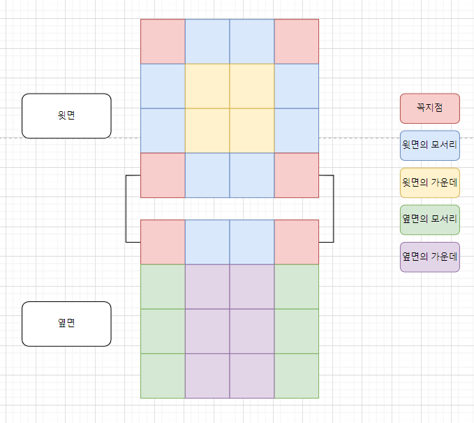

# 소스코드

```Java
import java.io.BufferedReader;
import java.io.IOException;
import java.io.InputStreamReader;
import java.util.Arrays;
import java.util.StringTokenizer;

public class BOJ1041 {
    public static void main(String[] args) throws IOException {
        BufferedReader br = new BufferedReader(new InputStreamReader(System.in));
        int N = Integer.parseInt(br.readLine());

        StringTokenizer st = new StringTokenizer(br.readLine());
        //
        long[] arr = new long[6];

        long min = Integer.MAX_VALUE;
        for (int i = 0; i < 6; i++) {
            arr[i] = Long.parseLong(st.nextToken());
            min = Math.min(min, arr[i]);
        }
        /**
         * 총 N * 5개의 수를 선택해야 함
         * 꼭지점은 3면의 합이 최소인 경우를 골라야함
         * 경우의 수 (4개 : 맨 위 꼭지점 4개)
         * A, B, D (0, 1, 3)
         * A, B, C (0, 1, 2)
         * A, E, C (0, 4, 2)
         * A, E, D (0, 4, 3)
         * B, D, F (1, 3, 5)
         * B, C, F (1, 2, 5)
         * F, E, D (5, 4, 3)
         * F, E, C (5, 4, 2)
         */
        /**
         * 꼭지 점 제외 두 면을 사용하는 끝은 2개의 면의 합이 최소인 것을 골라야함
         * N - 2개 * 8 (모든 모서리 - 꼭지점 : 4)
         * A, (B, C, D, E) 0, (1,2,3,4)
         * B, (C, D, F) 1, (2, 3, 5)
         * C, (E, F) 2, (4, 5)
         * D, (E, F) 3, (4, 5)
         * E, F (4, 5)
         */
        long res = getMin(arr, min, N);
        System.out.println(res);
    }

    private static long getMin(long[] arr, long min, int N) {
        if(N == 1){
            long sum = 0;
            long max = 0;
            for (int i = 0; i < 6; i++) {
                sum += arr[i];
                max = Math.max(max, arr[i]);
            }
            return sum - max;
        }
        //3개의 면의 합이 최소인 것 : 꼭지점은 3개의 면이 필요함.
        long[] cases1 = {
                arr[0] + arr[1] + arr[2],
                arr[0] + arr[1] + arr[3],
                arr[0] + arr[2] + arr[4],
                arr[0] + arr[3] + arr[4],
                arr[1] + arr[2] + arr[5],
                arr[1] + arr[3] + arr[5],
                arr[2] + arr[4] + arr[5],
                arr[3] + arr[4] + arr[5]
        };
        Arrays.sort(cases1);

        //2개의 면의 합이 최소인 것 : 모서리는 두개의 면이 필요함.
        long[] cases2 = {
                arr[0] + arr[1],
                arr[0] + arr[2],
                arr[0] + arr[3],
                arr[0] + arr[4],
                arr[1] + arr[2],
                arr[1] + arr[3],
                arr[1] + arr[5],
                arr[2] + arr[4],
                arr[2] + arr[5],
                arr[3] + arr[4],
                arr[3] + arr[5],
                arr[4] + arr[5],
        };
        Arrays.sort(cases2);
        long res = min * (N - 2) * (N - 2); // 윗면의 모서리, 꼭지점 제외 최소로 채운 값 (정사각형)
        res += min * 4 * (N - 1) * (N - 2); // 옆면 4개의 모서리, 꼭지점 제외 최소로 채운 값 (직사각형)
        res += cases1[0] * 4; // 꼭지점
        res += cases2[0] * (N - 1) * 4; // 세로 모서리
        res += cases2[0] * (N - 2) * 4; // 윗면 모서리
        return res;
    }
}
```

# 소요시간

40분

# 알고리즘

> 구현

# 풀이

# BOJ 1041 주사위


1. 주사위는 기본적으로 반대편 면을 제외하고는 닿아있다.
2. 주사위를 어떻게든 회전시키거나 해서 모든 면의 합을 최소로 만들어야 한다.
3. 이때 케이스를 여러가지로 나눠서 각각의 최소를 구해준다.  
    1. 케이스 1. 정육면체의 위 꼭지점 (4개)     
        > 정육면체의 꼭지점은 3개의 면이 보여져야 한다.      
        > 따라서, 3면이 나올 수 있는 조합들 중 최솟값을 하나 찾아서 이를 4개의 꼭지점이므로 * 4를 해서 더한다.
          
    2. 케이스 2. 정육면체의 위 모서리 (꼭지점 제외)     
        > 꼭지점을 제외한 모서리 부분은 2개의 면이 보여야 한다.     
        > 이때, 윗면은 꼭지점을 제외한 개수만큼 사용된다.       
        > 즉 N = 4이면, N - 2(꼭지점 2개를 뺀 개수) * 4개의 모서리 이다.    
        > 따라서 2면이 나올 수 있는 조합들 중 최솟값을 찾아서 이를 모든 윗면 모서리에 적용한 개수를 더한다.

    3. 케이스 3. 정육면체의 옆 모서리 (꼭지점 제외)     
        > 꼭지점을 제외한 모서리 부분은 케이스2와 동일하다.     
        > 하지만 아래면은 꼭지점으로 취급하지 않으므로 위의 꼭지점 개수인 1만 빼준다.       
        > 즉, N - 1 * 4개       

    4. 케이스 4. 가운데 직, 정사각형        
        > 윗면의 경우 N * N의 외곽을 모두 지우면 N - 1 * N - 1의 정사각형이 된다.       
        (위의 케이스 들에 의해 이미 구해진 값이므로 가운데만 구하면 된다.)      
        > 옆면의 경우 높이의 경우 맨 위 모서리만 제외하며,      
        > 옆면의 경우 양쪽 모서리를 빼줘야하므로 N - 1 * N - 2 * 4  
          (4개의 면이므로)

    5. 이렇게 구한 모든 케이스의 값을 더해준다.

4. 하지만, 이때 N = 1인 케이스를 커버하지 못하므로          
    N = 1일때는 주사위의 값을 모두 더하고 최대값만 빼주면 5개의 면을 최소로 채울 수 있다.


---
