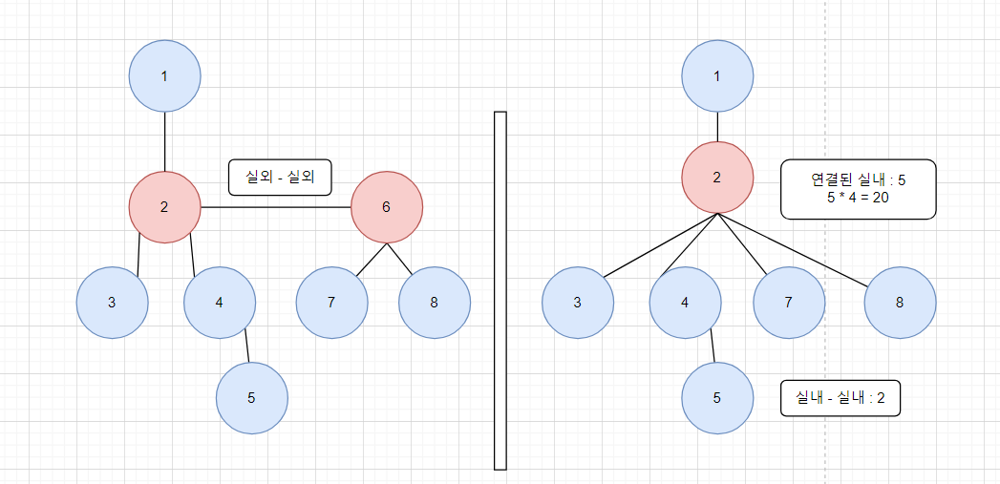

# 소스코드

```Java
import java.io.BufferedReader;
import java.io.IOException;
import java.io.InputStreamReader;
import java.util.ArrayList;
import java.util.List;
import java.util.StringTokenizer;

public class Main {
    static boolean in[];
    static int rank[];
    static int parents[];
    
    public static void main(String[] args) throws IOException {
        BufferedReader br = new BufferedReader(new InputStreamReader(System.in));
        int N = Integer.parseInt(br.readLine());
        String flag = br.readLine();
        in = new boolean[N];
        rank = new int[N];
        parents = new int[N];
        List<Integer> outs = new ArrayList<>();
        for (int i = 0; i < N; i++) {
            in[i] = (flag.charAt(i) - '0') == 1;
            parents[i] = i;
            if(!in[i]) outs.add(i);
        }

        int sum = 0;
        for (int i = 0; i < N - 1; i++) {
            StringTokenizer st = new StringTokenizer(br.readLine());
            //입력을 받으면서 부모를 찾는다.
            int from = find(Integer.parseInt(st.nextToken()) - 1);
            int to = find(Integer.parseInt(st.nextToken()) - 1);

            //직접 경로는 그냥 카운팅 (간선 연결 X)
            if (in[from] && in[to]) {
                sum += 2; //직접 경로는 2개 카운팅 (양방향이므로)
                continue;
            }
            //실외인 경우에는 연결된 실내들끼리 N * (N -1)개의 조합을 만들 수 있다.
            //따라서 실외인 경우 실외 끼리 연결된 경우는 실외 1개의 구역으로 본다.
            //트리이기 때문에 실외와 실외 연결에 다른 실내가 추가될 수 없음
            //즉 실외1 - 실외2가 연결되면 실외1 - 실내 - 실외2 인 경우가 나올 수 없음.
            //실외1 - 실외2 일때 실외1 - 실내 - 실외2가 되면 사이클이 생기므로
            if (!in[from] && !in[to]) {
                //한쪽으로 몰아주기
                if (rank[from] > rank[to]) {
                    union(to, from);
                } else {
                    union(from, to);
                }
                continue;
            }
            rank[from]++;
            rank[to]++;
        }
        //outs : 실외의 인덱스만 넣어둔 리스트
        for (int i = 0; i < outs.size(); i++) {
            int idx = outs.get(i);
            sum += (rank[idx]) * (rank[idx] - 1);
        }
        System.out.println(sum);
    }
    private static void union(int to, int from) {
        rank[from] += rank[to];
        rank[to] = 0;
        parents[to] = from;
    }

    private static int find(int v) {
        if(parents[v] == v) return v;
        return parents[v] = find(parents[v]);
    }
}
```

# 소요시간

3시간

# 알고리즘

> 유니온 파인드

# 풀이

# BOJ 21606 아침 산책



1. 처음에는 실내를 기준으로 DFS를 통해 완전 탐색을 수행했지만 메모리 초과가 발생했다.
2. 그래서 반대로 생각해보기로 했다.
3. 반대로 생각해서 실외를 기준으로 하면, 실외에 연결된 실내들은 무조건 해당 실내끼리 연결되지 않을까 라고 생각.     
    또한, 실외 - 실외 - 실내 이런 식으로 연결되어도 상관이 없음              
    > 트리이기 때문에 실외와 실외 연결에 다른 실내가 추가될 수 없음     
    > 즉 실외1 - 실외2가 연결되면 실외1 - 실내 - 실외2 인 경우가 나올 수 없음.      
    > 실외1 - 실외2 일때 실외1 - 실내 - 실외2가 되면 사이클이 생기므로
4. 따라서, 실외 - 실외를 `union`을 통해 하나의 실외로 합쳐주고 이에 연결된 실내의 개수를 합쳐준다.
5. 이때, 실내 - 실내 인 경우는 도중에 실내에 들어가면 종료이므로 이를 카운트 + 2해준다.     
    > 실내1 -> 실내2, 실내2 -> 실내1 의 2가지 경우가 가능하므로.
6. 최종적으로 실내 - 실내인 경우 * 2 + 실외를 거치는 경우의 조합의 합을 출력하면 된다.
7. 실외를 거치는 경우의 조합은 N * (N - 1)이 된다.      
    > 실외에 연결된 실내가 3개이면          
    > 실내1 -> 실외 -> 실내2, 3        
    > 실내2 -> 실외 -> 실내1, 3        
    > 실내3 -> 실외 -> 실내1, 2        
    > 이므로 N * (N - 1)이 된다.
8. 이를 출력한다.
---
