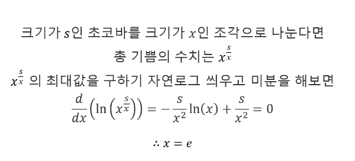

# 소스코드

```Java
import java.io.*;
import java.util.*;

public class Main {

    static final int MOD = 1_000_000_007;
    public static void main(String[] args) throws IOException {
        BufferedReader br = new BufferedReader(new InputStreamReader(System.in));
        StringTokenizer st = new StringTokenizer(br.readLine());

        int N = Integer.parseInt(st.nextToken());
        int M = Integer.parseInt(st.nextToken());

        long mul = N * M;
        long res = 1;
        while (mul > 4) {
            res *= 3;
            res %= MOD;
            mul -= 3;
        }
        res *= mul;
        res %= MOD;
        System.out.println(res);
    }
}

```

# 소요시간

2시간

# 알고리즘

> 수학, 그리디

# 풀이

# BOJ 31443 준영이



1. 해당 증명을 보면 자연로그 e (2.7xxx)로 나누었을 때가 기쁨의 수치를 최대로 만들 수 있다.
2. 하지만, 정수여야 하므로 이에 가장 가까운 3으로 최대한 많이 쪼개야 최대가 된다.
3. 하나의 예시로 6을 2,2,2로 나누면 2*2*2 = 8이고,          
   3,3으로 나누면 3 * 3 = 9가 된다.
4. 따라서, N * M에서 3씩 빼주고, 이를 결과값에 곱해준다.
5. 남은 N * M이 4보다 작으면 1,2보다 3하나만을 곱하는 것이 이득이므로 이를 곱해준다.

---
